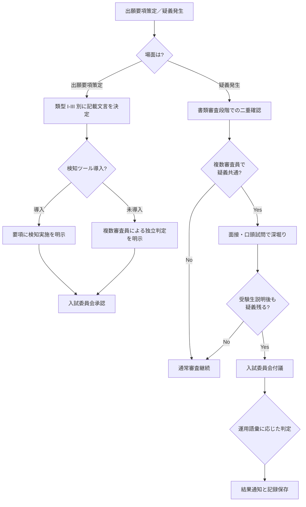

# entrance-exam-ai-policy

入試書類における生成 AI 使用の判断フレームワークと運用プロセス

---

## 1. Overview

総合型選抜・学校推薦型選抜の出願書類における生成 AI 利用は、2024 年以降急速に顕在化した入試部門固有の課題である。志望理由書や学修計画書において AI 生成テキストの混入が疑われるケースは複数大学で報告されており、検知ツールの検出率も 70% 程度にとどまる。

本スキルは、文部科学省「大学入学者選抜における生成 AI の取扱いについて」（2024-08-01）を骨格として、出願要項への記載文言・疑義発生時の確認プロセス・不正認定と教育機会のバランスを判断するフレームワークを提供する。

入試部門は高い中立性が求められるため、担当職員の個人判断で運用すると一貫性が揺らぐ。入試委員会での合意形成と、出願要項・審査マニュアル・疑義対応手順の 3 点セットを整備することが求められる。検知ツール未導入の大学でも、書類審査段階での複眼的確認・面接での深堀り・不自然さ検出のチェックリストで代替可能な運用を提示する。

「不正認定」と「教育機会」の境界は難しい判断である。山梨大学のように「不正行為・合格取消」を明言する踏み込んだ運用と、「AI 使用を禁止しつつ、発覚時は受験生との対話を通じて判断する」より柔軟な運用の両方が実在する。本スキルは各大学が選べるオプションを提示する。

---

## 2. Prerequisites

- 所属大学の AI 利用ガイドライン確認（特に入試関連規程との整合性）
- `skills/confidential-info-guidelines/` の 3 段分類の把握（受験生情報は Level 3 機密情報）
- 現行の出願要項における不正行為条項の確認
- 文科省「大学入学者選抜における生成 AI の取扱いについて」（2024-08-01）の内容把握
- 検知ツール（導入予定含む）の検出率・運用コストの現実的理解

---

## 3. 主な利用者

- **主な利用者**: 職員（入試課・アドミッションオフィス）
- **副次的利用者**: 入試委員会、副学長（入試担当）
- **意思決定主体**: 入試委員会が方針決定、入試課が運用

---

## 4. 判断フレームワーク

### 3 類型による判断

| 類型 | 対象書類 | AI 使用の扱い | 根拠 |
|---|---|---|---|
| 類型 I | 志望理由書 | 「そのまま使用」は禁止、支援的利用の扱いは大学が明示 | 受験生の動機・主体性を評価するため |
| 類型 II | 学修計画書・研究計画書 | 論旨の生成は禁止、文献検索等の補助は許容範囲を明示 | 受験生の学術的構想力を評価するため |
| 類型 III | 小論文（試験当日実施含む） | 試験時は完全禁止、事前課題型は類型 I に準じる | 試験場での筆記能力確認のため |

### 疑義発生時の二重確認プロセス

1. **書類審査段階**: 複数審査員による独立判定、不自然さの共通指摘があれば要精査
2. **検知ツール活用**: 導入大学のみ。検出率 70% 前提で補助的扱い
3. **面接・口頭試問**: 書類内容の深堀り質問で理解度確認
4. **受験生への事情聴取**: 不正認定前に受験生の説明機会を設ける

### 運用語彙の選択

- **踏み込み型**: 「不正行為」「合格取消」を明示（山梨大学型）
- **柔軟型**: 「AI 単独での作成は避けるよう求める」「記載が不自然な場合は面接で確認」
- **中間型**: 禁止は明示しつつ、疑義発生時は「教育機会」として面接を実施

### ツール未導入大学向け代替案

- 書類審査の複数審査員制（最低 2 名独立判定）
- 面接での深堀り質問リストの整備
- 志望理由書の「本校での学びを選んだきっかけ」等、個人史と結びつく質問を審査項目に含める
- 入試委員会での疑義ケース共有会（学期末等）

---

## 5. 判断フロー

---

## 6. 使用場面

### シーン A: 2027 年度入試要項に AI 使用方針を記載する

入試課長から「次年度の要項に AI 使用方針を明示したい」と相談。類型 I-III 別の記載文言案を作成し、入試委員会に付議する。踏み込み型・柔軟型・中間型の 3 案を提示、メリット・デメリットを整理して委員会の選択に委ねる。検知ツール導入は予算制約で困難なため、複数審査員制を前提に要項文言を組み立てる。

### シーン B: 総合型選抜の志望理由書に疑義が生じた

書類審査を担当した教員 2 名から「表現が不自然に流暢」「固有名詞の使い方が他書類と異なる」との指摘。面接官に情報を共有し、志望動機の具体的きっかけを深掘りする質問を用意。受験生の回答が書類記載と整合するか、想定外の質問に対応できるかを観察する。入試委員会に事案として記録し、判定は委員会方針に従う。

### シーン C: 検知ツール導入を検討している

ベンダーから営業提案。検出率 70% 程度、年間数百万円の運用コスト。単年度予算での継続判断が必要。代替案として、審査員研修の充実と複数審査員制の強化、面接での深堀り質問整備を提案する文書を作成、費用対効果を比較して入試委員会に上程する。

→ より詳細な事例は [`examples/example-01-sougou-senbatsu-suspicion.md`](examples/example-01-sougou-senbatsu-suspicion.md) を参照。

---

## 7. Limitations

- **所属大学の入試規程が最優先**: 本スキルは汎用フレームワーク、各大学の入試委員会方針が常に優先される
- **検知ツール検出率は 70% 程度**: AI 検知を絶対基準にできない。二重確認が必須
- **不正認定には受験生の説明機会を**: 一方的認定は後日の異議申立てリスクが高い
- **文科省通知・出願要項は毎年更新**: 半期改訂時に最新状況を再確認
- **ツール仕様変更**: 生成 AI 側の高度化で検知回避が進む可能性があり、書類審査方法自体の設計が重要
- **法的助言ではない**: 不正認定・合格取消等の判断は、必ず法務部門・顧問弁護士と協議すること

---

## References

- 【政府一次ソース】文部科学省「大学入学者選抜における生成 AI の取扱いについて」（2024-08-01） https://www.mext.go.jp/content/20240801-mxt_daigakuc02-000037448_21.pdf
- 【大学公式ガイドライン】（事例参照）山梨大学「入学者選抜における生成 AI の取扱いについて」 https://www.yamanashi.ac.jp/examination/49103
- 【実務家・研究者】河合塾「志望理由書 AI 生成検知システム」関連報道 https://www.kawaijuku.jp/jp/news/detail.html?id=668
- 【実務家・研究者】河合塾 Kei-Net Plus「生成 AI の登場は大学入学者選抜に影響を与えるのか」
