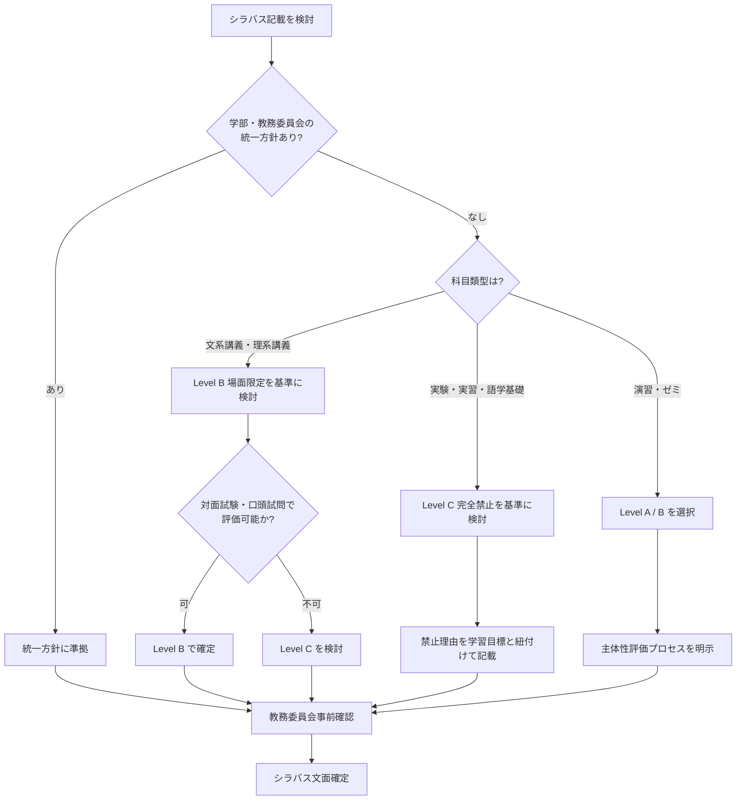

# syllabus-ai-policy

授業のシラバスに生成 AI 使用ルールを記載する際の 4 段階テンプレートと科目類型別の選択肢カタログ

---

## 1. Overview

シラバスに「生成 AI の使用可否」をどう書くかは、2023 年以降すべての大学教員が直面する問いになった。「禁止」と書くだけでは検証困難で、「自由」と書くと評価の公平性が揺らぐ。現場で必要なのは「この科目の性格に応じてどう書けばいいか」の判断枠組みである。

本スキルは、4 段階テンプレート（自由／場面限定／完全禁止／その他）と、科目類型（文系講義／理系講義／実験／演習）別の選択肢カタログを提供する。教員が 3 つの質問に答えるだけで、シラバスにそのまま貼り付けられる文言が決まる設計になっている。

大学の単年度予算制約下で、AI 検知ツール導入は前提にしない。対面試験や口頭試問など、既存の評価方法で担保できる範囲を優先して設計する。教員の学問的自由と教務委員会の統一性要請の間でバランスを取るため、各大学規程との整合性確認を判断フローに組み込んである。

このスキルは教員自身の判断を支援するだけでなく、教務委員会での共通テンプレート策定や、教務職員が教員に配る「シラバス記入の手引き」作成にも使える。

---

## 2. Prerequisites

- 所属大学の AI 利用ガイドライン確認（全学ポリシー／学部別方針／教務委員会申合せ）
- `skills/confidential-info-guidelines/` の 3 段分類の把握（学生課題に含まれる個人情報等の扱い）
- 科目のシラバス記載様式・提出期限（多くの大学で前期開始 2 ヶ月前までに確定）
- 授業評価における AI 利用の扱いに関する学部 FD での議論経緯

---

## 3. 主な利用者

- **主な利用者**: 教員（授業担当者）
- **副次的利用者**: 教務委員会（統一方針策定時）、教務職員（運用支援・教員への記入支援）
- **意思決定主体**: 教員が個別授業で判断、ただし学部・学科の統一方針がある場合は優先

---

## 4. 判断フレームワーク

### 4 段階テンプレート

| レベル | 方針 | 想定場面 | シラバス記載の骨子 |
|---|---|---|---|
| Level A | 自由使用 | 探究系演習・発展的ゼミ | 使用を歓迎、最終成果物の責任は学生 |
| Level B | 場面限定使用 | 通常講義・課題レポート | 特定の場面のみ許可（例: 下書き・翻訳支援） |
| Level C | 完全禁止 | 語学基礎・実技・実習 | 使用禁止、発覚時の対応を明示 |
| Level D | その他 | 個別事情のある授業 | 授業内で別途指示 |

### 科目類型別の選択肢カタログ

- **文系講義**: Level B が標準（文献整理の補助は可、論述の代替は不可）
- **理系講義**: Level B が標準（演習問題の検算補助は可、回答の生成は不可）
- **実験・実習**: Level C が標準（プロトコル遵守、AI による考察代替禁止）
- **演習・ゼミ**: Level A または Level B（主体性重視の指導方針に応じて選択）

### 教員 3 質問判断フロー

1. この授業で学生に「自力で身につけてほしい能力」は何か？
2. その能力は AI 使用下でも評価可能か？（対面試験／口頭試問／プロセス評価等）
3. 所属学部・教務委員会の統一方針はあるか？

### 4.6 学生への周知文テンプレート（期初ガイダンス用）

シラバス記載だけでは学生に方針が浸透しないため、初回授業で口頭説明する際の雛形を Level 別に用意する。

**Level A（自由使用）向け**:
> 本授業では生成 AI の使用を歓迎します。ただし「使った」ことではなく「どう使い、何を自分で考えたか」を評価します。使用記録の記載と、発表時の口頭確認で理解度を見るため、AI 出力の丸写しは評価対象外となります。

**Level B（場面限定使用）向け**:
> 本授業では AI 使用を特定場面（例: 文献整理・英文校正・推敲）に限り認めます。許可場面は課題配布時に明示するため、許可されていない用途での使用は不正扱いとなります。疑義がある場合は口頭試問で理解度を確認します。

**Level C（完全禁止）向け**:
> 本授業の学習目標は AI に代替できない能力の習得にあります。課題・試験における AI 使用は禁止とし、違反が判明した場合は該当課題を 0 点とします。禁止する理由は学習目標（例: 実験データからの独立した考察）と直結しており、評価の公平性のためご協力ください。

**Level D（その他）向け**:
> 本授業では課題ごとに AI 使用方針を個別指示します。各課題配布時に「どの Level か」を明示するため、指示書を毎回確認してください。共通事項として、機密情報・他者個人情報の AI 入力は全 Level で禁止です。

各テンプレートは、所属大学のガイダンス資料・初回スライドに貼り付けて使える粒度に揃えてある。

### 4.7 学科内で方針を統一する合意形成プロセス

学科単位で AI 方針を統一する場合、以下 4 段ステップで進める。個別教員の学問的自由を尊重しつつ、学生への一貫したメッセージを担保する狙い。

1. **教務委員会による原案作成**: 本スキルの 4 段階テンプレートを叩き台に、学科の科目類型マトリクスを作成。委員会内で 2-3 回の議論で原案を固める
2. **学科会議での議論**: 原案を学科会議に諮り、各専門分野の教員意見を聴取。特に実験系／演習系／語学系で異論が出やすいため、事例ベースで議論する
3. **教員個別承認**: 学科共通方針を個別授業にどう反映するか、各教員が選択可能な範囲を明示。共通方針から外れる場合は理由書提出（教育上の合理性があれば可）
4. **シラバス反映とレビュー**: 前期開始 2 ヶ月前のシラバス確定期に合わせ、教務職員が全科目のシラバス記載をレビュー。Level 選択と文言の整合を確認

**反対意見対応**: 「学問的自由の侵害では」との指摘には、本方針が推奨フレームワークであり強制でないこと、個別事情は Level D で吸収可能であることを説明する。「検知困難で実効性がない」との指摘には、AI 検知ツール非前提で対面試験・口頭試問で担保する設計であることを繰り返し伝える。

関連: 本学科方針と `ai-use-risk-classification` スキルの Level 分類、`confidential-info-guidelines` の機密情報扱いと相互参照して一貫性を保つこと。

---

## 5. 判断フロー

---

## 6. 使用場面

### シーン A: 文系講義「日本近代史」の担当教員が悩む

受講者 80 名の講義。期末レポート（4000 字）で評価。AI でそれらしい論述が生成できてしまう懸念あり。判断フローに沿うと、学問的能力としては「一次史料に基づく批判的思考」が核であり、AI で代替不可能な対面小テスト併用で評価可能。したがって Level B を選び、「文献リスト整理・訳出補助は可、論述本文の生成不可」とシラバスに記載する。

### シーン B: 理系実験「生化学実験 I」の共同担当者で方針を統一したい

担当教員 4 名で統一方針を決めたい。実験プロトコル遵守と実測データの扱いが核であるため、Level C 完全禁止が自然。シラバス記載は「実験結果の考察を AI で生成することは禁止する。実験記録・考察は自筆で記述し、疑義がある場合は再実験または口頭試問で確認する」とする。単年度予算では検知ツール導入は非現実的だが、実験記録と考察の一貫性確認で不自然さは検出可能。

### シーン C: 教務委員会で学部共通テンプレートを整備したい

教務委員長の依頼。学部 30 科目の教員がばらばらに書くと混乱するため、4 段階テンプレートを学部 FD で共有し、各教員が Level A-D のいずれかを選択して文言を貼り付ける運用を提案。committee 承認後、教務職員が教員向け記入ガイドを作成する。

### シーン D: 文系ゼミ（文学・歴史学）での Level B 運用

文学部「日本近代文学演習」のゼミ担当教員。発表・討議中心の授業で、AI を禁止すると文献検索の機会損失が大きいが、解釈・批評部分まで AI に委ねると学生の学問的成長を阻害する。Level B を選び「文献・原典検索・書誌情報整理は可、解釈・批評本文の生成は不可」と明示。ゼミ発表で引用箇所の原典確認を行うことで、AI 出力の丸写しを抑止する。

### シーン E: 実験実習で Level C を採用する際の合意形成

化学実験の教員 5 名で担当する共通科目。AI 全面禁止の方向で一致しているが、「文法チェックまで禁止するのは過剰では」との意見あり。学科会議で議論し、Level C をベースに「英文校正・文法チェックは例外的に許容、考察・結論の生成は厳禁」と細則を追加。`ai-use-risk-classification` スキルのリスク区分と対応付けて学生にも説明する。

→ より詳細な事例は以下を参照:
- [`examples/example-01-syllabus-ri-zemi.md`](examples/example-01-syllabus-ri-zemi.md) 理系ゼミの Level A 運用
- [`examples/example-02-bunkei-kogi.md`](examples/example-02-bunkei-kogi.md) 文系講義の Level B 判断
- [`examples/example-03-jikken-jisshu.md`](examples/example-03-jikken-jisshu.md) 実験実習の Level C 判断

→ 文言テンプレートは [`references/sample-syllabus-wording.md`](references/sample-syllabus-wording.md) を参照。

---

## 7. Limitations

- **所属大学の AI 利用ガイドラインが常に優先**: 学部・教務委員会の統一方針がある場合、本スキルの推奨より優先される
- **AI 検知ツール非前提**: 検知ツール導入は単年度予算では困難なケースが多く、本スキルは既存評価方法（対面試験・口頭試問・プロセス評価）での担保を前提にする
- **AI サービスの陳腐化**: シラバス記載時点で想定していたサービス仕様が学期途中で変わる可能性。半期改訂時に見直すこと
- **学生の AI 利用実態との乖離**: 教員がシラバスで「禁止」と書いても、学生が守るとは限らない。評価方法自体の設計が重要
- **法令・ガイドライン改正**: 文部科学省・学会ガイドラインの改正時は速やかに反映

---

## References

- 【政府一次ソース】文部科学省「大学・高専における生成 AI の教学面の取扱いについて」 https://www.mext.go.jp/b_menu/houdou/mext_01260.html
- 【大学公式ガイドライン】（構造参照）九州大学 未来人材育成機構「シラバスに記載する AI 使用ルール」 https://mirai.kyushu-u.ac.jp/_cms_dir/uploads/2023/09/syllabus_rule.pdf
- 【大学公式ガイドライン】（構造参照）立命館アジア太平洋大学 AI ポリシー（APU）
- 【学術研究】AI Assessment Scale (AIAS), Perkins, Furze et al. https://aiassessmentscale.com/
- 【大学公式ガイドライン】（構造参照）国立清華大学（台湾）「生成式人工智慧伦理声明」4 選択肢モデル https://curricul.site.nthu.edu.tw/p/404-1208-248357.php
- 【大学公式ガイドライン】（構造参照）国立政治大学（台湾）「生成式 AI 简要原则」 https://sites.google.com/g.nccu.edu.tw/nccubasicprincipleforai
