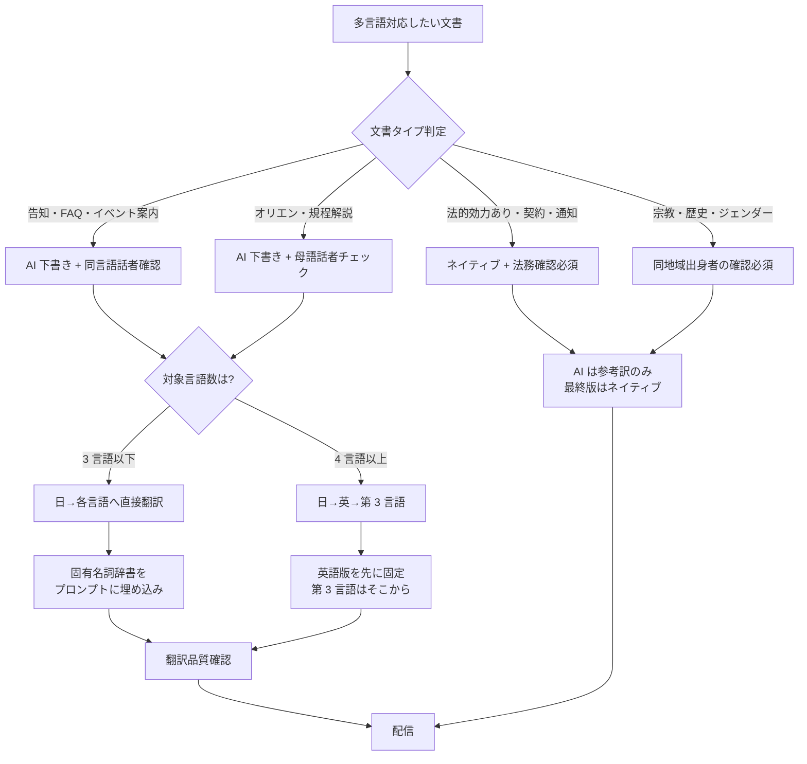

# multilingual-student-communication

留学生・外国人研究者向けの多言語コミュニケーションで AI 翻訳を活用する判断フレームワーク

---

## 1. Overview

留学生や外国人研究者への案内は、従来、英語版のみ用意して他言語は「要望ベース」で対応してきた大学が多い。しかし生成 AI の翻訳品質向上と、東北大学の 30 言語対応チャットボット（2024 年）のような先行事例を受けて、中小規模の大学でも十数言語の FAQ・案内文を現実的な工数で整備できるようになった。

一方で、AI 翻訳だけで完結させてよい文書と、必ずネイティブチェックや法務確認を経るべき文書の区別は、現場で迷いやすい。告知文・FAQ・イベント案内のようなルーティン業務は AI で完結可能だが、MOU などの覚書、奨学金の受給条件通知、ビザ関連の法的文書、宗教・歴史認識に関わる配慮文は、AI 単独で配信すべきではない。

さらに多言語展開では、固有名詞（学部名・職位名・部署名の正式英称）、文化・宗教配慮（食事制限・祝日・ジェンダー表現）、リレー翻訳での精度劣化という 3 つの技術的な落とし穴がある。本スキルは、これらを判断フロー・辞書・チェックリストで構造化し、国際課・留学生センターの少人数体制でも運用できる水準に落とし込む。

大学固有の制約として、単年度予算で DeepL Pro や ChatGPT Enterprise を新規契約しづらい場合があり、Web 版 AI と学内リソースの組み合わせでどこまで対応できるかの線引きが重要になる。

---

## 2. Prerequisites

- 所属大学の AI 利用ガイドライン、および外国人留学生の個人情報取扱規程の確認
- `skills/confidential-info-guidelines/` の 3 段分類の把握（特に Level 2 内部文書の入力可否）
- 大学公式の英文名称集（学部・研究科・職位・部署）の所在確認
- 翻訳先言語の母語話者職員・留学生 TA の連絡体制

---

## 3. 主な利用者

職員（国際課・留学生センター・学生支援課の海外対応担当）。教員（留学生指導・受入教員）も二次利用者として想定するが、契約書・MOU の最終承認は法務部門が担う。

---

## 4. 判断フレームワーク

### 4-1. AI 完結可 / ネイティブチェック必須の二分基準

| 文書タイプ | AI 完結可否 | 理由 |
|---|---|---|
| イベント告知・履修案内 | AI 完結可 | ルーティン、事実誤認の影響が限定的 |
| 多言語 FAQ（奨学金・住居・医療等） | AI 下書き + 同言語話者の目視確認 | 誤訳が学生行動に直結 |
| オリエンテーション資料 | AI 下書き + 1 言語 1 名の母語話者確認 | 学則・規程の用語解釈が絡む |
| 奨学金受給条件通知・学籍関連通知 | ネイティブチェック必須 | 法的効力・不利益変更の可能性 |
| MOU・協定書・契約書 | AI 参考訳のみ、法務と相手方言語圏法務の二重確認 | 法的拘束力、外国法準拠 |
| 宗教・歴史認識・ジェンダーに関わる文書 | ネイティブチェック必須 | 文化配慮の解像度が文面で変わる |

### 4-2. 固有名詞辞書化の対象

学部名・研究科名・学位名・職位名・部署名・規程名は AI が誤訳しやすい。事前に正式英称・公式訳の辞書を用意し、プロンプトで明示する。既に大学公式サイトに英語版があれば、そこから抽出する。

### 4-3. リレー翻訳の精度劣化対策

日→英→第 3 言語のリレー翻訳は、中間の英語で情報が圧縮される分、精度が下がる。対策: ①日本語から直接目標言語へ翻訳、②固有名詞・数字・日付を原文併記、③翻訳後に同言語話者が原文と突き合わせる、の 3 点。

### 4-4. 文化・宗教・敏感トピックのチェック

食事（ハラール・ヴィーガン・宗教食）、祝日（宗教カレンダー）、ジェンダー表現（敬称・代名詞）、歴史認識（国名表記・地域呼称）は、言語ごとに許容範囲が異なる。宗教・政治・歴史認識に関わる内容は AI 単独配信を避け、必ず同地域出身者の目視確認を経る。

---

## 5. 判断フロー

---

## 6. 使用場面

### シーン A: 留学生向け奨学金 FAQ の多言語化

奨学金 FAQ（日本語で 30 問、A4 で 8 ページ）を英・中・韓・タイ・ベトナムの 5 言語化したい。文書タイプは「FAQ」なので AI 完結寄りだが、受給条件・返還義務の誤訳は学生に不利益が及ぶ。大学公式サイトの英語版から固有名詞辞書を抽出し、日本語から各言語へ直接翻訳した後、留学生センターの各国出身 TA に目視確認を依頼する。

### シーン B: 新入留学生向けオリエンテーション資料

新入留学生 120 名（10 か国出身）に配るオリエン資料を多言語化したい。英語版をマスターとして先に固定し、他言語は英語版から翻訳するリレー方式を採る。大学の学事暦・規程名・担当窓口名を固有名詞辞書に登録し、翻訳精度の底上げを図る。宗教上の配慮事項（食事・礼拝室・休暇）の記述は、各地域出身の教職員・留学生 TA の事前確認を必須とする。

### シーン C: 海外大学との MOU 英文ドラフト

姉妹校候補との学術交流協定（MOU）のドラフトを英語で準備したい。AI は論点整理と初稿生成に使用するが、最終文面は法務部門と相手方大学の国際部が確認する。Web 版 AI には学内未公開の協定条件を入力しないこと（Level 2 情報）。Enterprise 版・API 版でも、確定前の条件は限定的な範囲で扱う。

→ 詳細は [`examples/example-01-ryugakusei-faq.md`](examples/example-01-ryugakusei-faq.md) を参照。

---

## 7. Limitations

- 所属大学の留学生個人情報保護ガイドラインと AI 利用規程が常に優先
- AI 翻訳モデルの言語別品質は頻繁に更新される。定期的な再評価が必要
- マイナー言語（モンゴル語・ミャンマー語等）は AI 翻訳品質が低い場合があり、ネイティブ依存度を上げる必要がある
- 法的効力を持つ文書（契約・覚書・学籍変更通知）の最終責任は人間（法務・国際担当部長）にある。AI は下書きツールに留まる
- 宗教・歴史・政治的に敏感な表現は、技術的な翻訳品質とは別の論点。AI チェックでは検出できない文脈を含む

---

## References

- 【政府一次ソース】文部科学省「大学・高等専門学校における生成 AI の教学面での取扱いについて」事務連絡 2023-07-13（翻訳活用場面）
- 【大学事例】東北大学「生成 AI 応対チャットボット 30 言語対応」2024-03-29（運用モデル参照）
- 【大学事例】立命館大学 Transable（語学教育 AI、2023-2024）
- 【実務家】森木 P4Us（Prompt Guide for University Staff, MIT License）文書作成章
