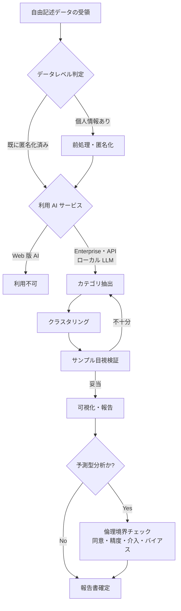

# ir-freeform-text-analysis

学生調査・授業評価の自由記述を生成 AI で分析する判断フレームワーク

---

## 1. Overview

IR（Institutional Research）業務では、学生調査・授業評価・大学評価の自由記述回答を扱うことが多い。従来は KH Coder 等の質的分析ツールや、職員による目視集計が中心だったが、生成 AI の登場により、数百〜数千件の記述データからカテゴリ抽出・傾向可視化を短時間で行える可能性が開けた。

一方、自由記述には学生の氏名・学籍番号・特定できる個人情報が混入しやすく、Web 版 ChatGPT 等に生データをそのまま入力することは情報漏洩リスクを伴う。匿名化・前処理の工程を省略すると、AI サービス側の学習データに学生発言が流れ込む可能性があり、個人情報保護法および各大学の学生データ取扱規程に抵触する。

本スキルは、森木氏自身の Speaker Deck「大学 IR における生成 AI 利用の試み」を中心に、大学 IR コンソーシアム学生調査、大学評価 SD 事例を統合し、自由記述分析を 7 ステップ（データ取得→前処理・匿名化→カテゴリ抽出→クラスタリング→検証→可視化→報告）に構造化する。さらに、中退予測・学業予警のような「予測型」分析には、倫理境界（同意・予測精度・介入権限・バイアス監査）を明示する。

大学固有の制約として、単年度予算で ChatGPT Enterprise や API を新規契約しづらい場合があり、ローカル LLM（LM Studio / Ollama 等）や学内 GPU サーバーの活用、Web 版 AI 禁止時の代替手段も併せて検討する必要がある。

---

## 2. Prerequisites

- 所属大学の AI 利用ガイドライン、学生データ取扱規程、研究倫理審査の確認
- `skills/confidential-info-guidelines/` の 3 段分類の把握（学生データは原則 Level 3）
- 個人情報保護法における「要配慮個人情報」「特定の個人を識別できる記述」の理解
- 前処理ツール（Excel・Python・KH Coder 等）の基本操作
- IR コンソーシアム・大学基準協会等の質的分析の標準手順の参照

---

## 3. 主な利用者

職員（IR 室・評価室・教学 IR 担当・大学評価担当）。教員（IR センター兼任教員）と連携することも多いが、学生個人データの直接取扱いは職員主導が原則。

---

## 4. 判断フレームワーク

### 4-1. 前処理パイプライン（匿名化の必須項目）

自由記述データは**生のまま AI に入れない**。氏名・学籍番号（削除）、教員名・科目名（「教員 X」「科目 Y」に記号化）、所属ゼミ・部活名（学年・学部のみ残す）、具体的日時・場所（抽象化）、家族・交友関係の個別言及（「家族」「友人」に総称化）を除去・置換する。さらに k-匿名化（k=5 以上推奨）を意識し、4 属性（学年・学部・性別・国籍）の組み合わせで 5 名未満になる記述は、属性の粒度を落とす。

### 4-2. AI サービスの使い分け

| サービス | Level 2 | Level 3（匿名化前） | Level 3（匿名化後） |
|---|---|---|---|
| Web 版 ChatGPT（Free/Plus） | 不可 | 不可 | 不可（仕様変更リスク） |
| ChatGPT Team / Enterprise | 条件付き可 | 不可 | 条件付き可 |
| Claude Pro / Team | 条件付き可 | 不可 | 条件付き可 |
| API 利用（学習オフ契約） | 可 | 不可 | 可 |
| ローカル LLM（Ollama 等） | 可 | 可（組織ポリシー次第） | 可 |

Web 版は匿名化後でも、将来の仕様変更リスクを考慮して業務利用から外すことを推奨。

### 4-3. 分析手順の 7 ステップ

①データ取得 → ②前処理・匿名化 → ③カテゴリ抽出 → ④クラスタリング → ⑤検証 → ⑥可視化 → ⑦報告。各ステップの作業内容・ツール・検証ポイントは [`references/workflow-steps.md`](references/workflow-steps.md) 参照。

### 4-4. KH Coder 等との役割分担

- **KH Coder・NVivo 等の質的分析ツール**: 語彙頻度・共起ネットワーク・コーディング再現性
- **生成 AI**: カテゴリ仮説生成・要約・対話的な再分類・報告書下書き

両者は競合ではなく補完関係。質的分析ツールで計量的な裏付けを取り、AI で解釈と要約を効率化する。

### 4-5. 中退予測・学業予警の倫理境界

中退リスク予測・学業予警を AI で行う場合、以下の境界線を守る。

- **同意**: 学生への事前告知と同意取得（オプトアウト含む）
- **予測精度**: 誤検知・見逃しの許容範囲を事前設定。予測を「決定」でなく「支援のきっかけ」として扱う
- **介入権限**: AI 出力で自動的に学生に接触せず、教員・職員の判断を必ず挟む
- **バイアス監査**: 性別・国籍・経済状況で予測精度が偏っていないか定期的に確認
- **説明責任**: 学生から「なぜ自分が接触対象になったか」の問い合わせに応えられる透明性

---

## 5. 判断フロー

---

## 6. 使用場面

### シーン A: 授業評価アンケート自由記述（600 件）の傾向分析

1 学期分の授業評価（対象 50 科目、600 件の自由記述）を学部単位で傾向分析したい。個別科目の評価は別ルートで教員個人にフィードバックし、本分析では全体傾向（「授業時間配分」「課題量」「対話機会」等）の把握が目的。前処理で教員名・科目名を「教員 X」「科目 Y」に置換し、API 経由でカテゴリ抽出・クラスタリングを実施。サンプル 30 件を職員が目視検証し、カテゴリ妥当性を確認する。

### シーン B: 新入生アンケート自由記述のカテゴリ抽出

新入生 800 名を対象とした入学時アンケートで、「大学選択理由」「不安に感じていること」「期待すること」の 3 問が自由記述。職員 1 名で全件目視は 3 日かかるため、AI でカテゴリ抽出を効率化したい。匿名化後、Enterprise 版で 10-15 カテゴリに分類させ、カテゴリ別の代表発言を抽出。検証後、各カテゴリの件数分布を執行部向け資料にまとめる。

### シーン C: 大学評価における SD 活動の記述データ整理

大学基準協会の認証評価に向け、過去 3 年間の SD 活動報告書（数百件、職員記述）を整理。評価項目ごとに「取り組み内容」「成果」「課題」を抽出する必要がある。SD 活動報告は Level 2 相当（学内限定）のため、Enterprise 版か API 経由で扱い、カテゴリ抽出と要約を実施。職員が最終整理し、自己点検・評価書の下書きに活用する。

→ 詳細は [`examples/example-01-jugyo-hyoka-jiyukijutsu.md`](examples/example-01-jugyo-hyoka-jiyukijutsu.md) を参照。

---

## 7. Limitations

- 所属大学の学生データ取扱規程・研究倫理審査手続が常に優先
- AI によるカテゴリ抽出は、プロンプトと初期サンプルに依存する。複数回実行で結果が変わる場合があり、再現性の担保には固定シード・プロンプト版管理が必要
- 中退予測・学業予警のような「介入に繋がる分析」は、バイアスが学生の機会を直接奪う可能性があるため、倫理審査と事前告知を必須とする
- KH Coder 等の確立された質的分析ツールを置き換えるものではなく、補完ツールとして位置づける
- 単年度予算で Enterprise 契約ができない場合は、ローカル LLM 活用を含めた代替手段の確立が必要
- 小規模サンプル（50 件未満）では統計的傾向として扱うには慎重さが必要。AI が「もっともらしい」カテゴリを過剰に生成する傾向がある

---

## References

- 【実務家（直接参照可）】森木「大学 IR における生成 AI 利用の試み」Speaker Deck（2024）https://speakerdeck.com/gmoriki/da-xue-irniokerusheng-cheng-aili-yong-noshi-mi
- 【団体】一般社団法人大学 IR コンソーシアム 学生調査 https://irnw.jp/investigate
- 【実務家】「生成 AI を活用して大学評価の活動は効率化できるか」（daigaku23.com、2024）
- 【海外団体（構造のみ参照）】AIR "Sailing Through the Challenges of AI in Institutional Research"、AIR Statement of Ethical Principles
- 【海外大学事例（構造のみ参照）】華中科技大学「智能学业预警与协同帮扶机制」（予警モデルの運用論点）
- 【政府一次ソース】文部科学省「大学・高等専門学校における生成 AI の教学面での取扱いについて」事務連絡 2023-07-13
