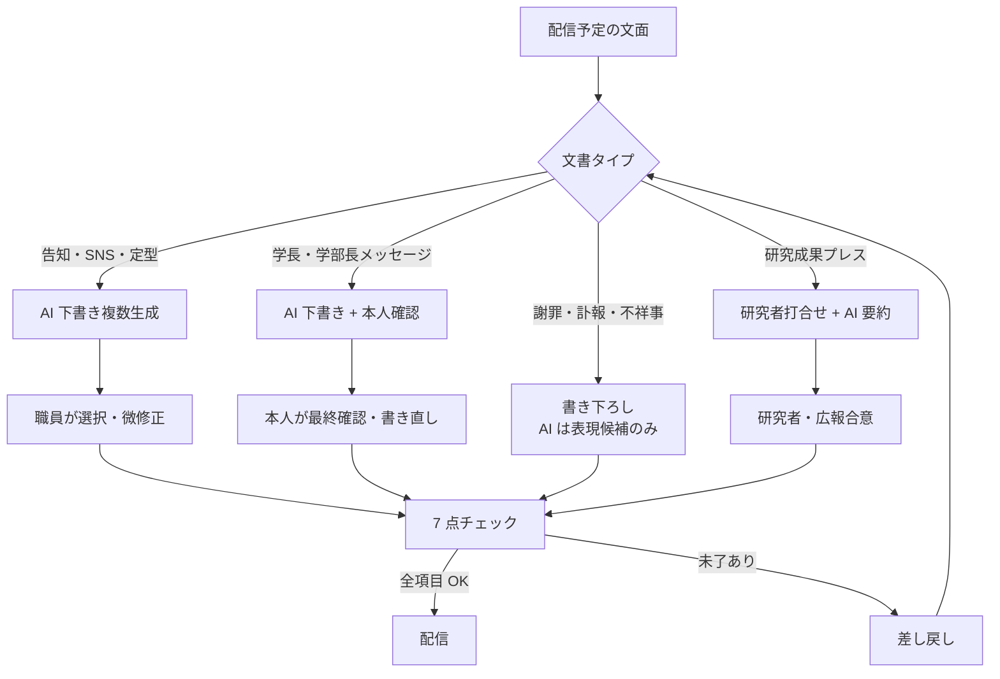

# pr-ai-checklist

大学広報での生成 AI 活用を 7 点チェックで品質管理する判断フレームワーク

---

## 1. Overview

大学広報は、少人数（多くの私大で専任 2-4 名）で学長・学部長メッセージ、プレスリリース、SNS 投稿、広報誌、オープンキャンパス告知など、多様な文面を量産する必要がある。生成 AI は下書き生成と表現バリエーション作成を劇的に効率化する一方、「大学らしい品位」「事実性」「公平性」を欠いた文面が配信されれば、ブランド毀損は短時間で広がる。

武蔵野大学が 2023-2024 年に展開した「AI ナレーター広報コンテンツ」のような先行事例が生まれる一方、海外ではプレスリリースに紛れ込んだ AI 作文の誤記（存在しない受賞・不適切な人名）が炎上を招く例も報告されている。

本スキルは、広報文面の配信前チェックを 7 項目に構造化し、AI の下書きを使う場面（表現バリエーション・定型告知）と、完全書き下ろしが必要な場面（学長メッセージ・謝罪文・訃報）を明示する。さらに、学長・学部長・課長の 3 階層で要求される文体差と、配信前の学内合意経路を併記する。

大学固有の制約として、広報課は学生個人情報（受賞学生の本名公表可否等）・研究情報（論文発表前の機密情報）・人事情報（退職・昇進）など Level 2-3 の情報を扱う機会が多く、AI 入力時の判定が欠かせない。

---

## 2. Prerequisites

- 所属大学の AI 利用ガイドラインと広報規程の確認
- `skills/confidential-info-guidelines/` の 3 段分類の把握（特に Level 3 の学生・人事・未公表研究）
- 学長・学部長・課長クラスの文体サンプルの蓄積
- 広報ブランドガイドライン（ロゴ・色・トンマナ）の所在確認

---

## 3. 主な利用者

職員（広報課・企画広報室・渉外課）。学長室・研究推進課とは配信前調整で連携するが、広報責任は広報部門にある。

---

## 4. 判断フレームワーク

### 4-1. 配信前 7 点チェックリスト

| # | 項目 | 確認内容 |
|---|---|---|
| 1 | 正確性 | 人名・日付・数値・受賞名等の事実誤認がないか |
| 2 | バイアス | 性別・国籍・障害・宗教・年齢に関する差別的表現がないか |
| 3 | 著作権 | 他媒体の表現・画像・楽曲を無断流用していないか |
| 4 | 出典 | データ・引用の出典が明示されているか |
| 5 | ブランド整合 | 大学のトンマナ・ブランドガイドラインに沿っているか |
| 6 | プライバシー | 個人（学生・教職員・第三者）の同意なき実名公表がないか |
| 7 | 学内規程整合 | 利害関係者への事前通知・承認手続きが完了しているか |

すべてにチェックがつくまで配信しない。1 項目でも未了なら差し戻す。

### 4-2. 文書タイプ別の AI 活用度

| 文書タイプ | AI 活用度 | 運用 |
|---|---|---|
| オープンキャンパス告知 SNS | 高 | 複数パターン AI 生成、職員選択 |
| 定型プレスリリース（入試実施・イベント終了報告等） | 中 | AI 下書き + 職員書き直し |
| 学部長・学長の一般メッセージ | 中 | AI 下書き + 本人確認・書き直し |
| 謝罪文・訃報・不祥事対応 | 低 | 書き下ろし、AI は表現候補のみ |
| プレスリリース（研究成果発表） | 低〜中 | 研究者との打ち合わせが主、AI は要約補助 |

### 4-3. 3 階層の文体差

- **学長メッセージ**: 教育理念・社会的責任・長期ビジョンを包含。一人称「私」または「学長として」。過度に砕けない
- **学部長・研究科長メッセージ**: 専門領域の誇りと学びの具体性。一人称「私」、学生を「皆さん」
- **課長・事務部門通知**: 手続き・事実の正確な伝達。一人称は避け、部署名で発信

### 4-4. ディープフェイク・生成画像の扱い

AI 生成画像・音声・動画の配信は、透かし表示を徹底するか原則配信しない。特に「人物の顔が写る広報写真」「学長の音声・映像」を AI で生成しての配信は、大学ブランドへの信頼を損なう可能性が高い。武蔵野大学のような AI ナレーター事例でも「AI 音声であること」の明示を前提とする。

---

## 5. 判断フロー

---

## 6. 使用場面

### シーン A: オープンキャンパス告知 SNS 投稿の複数パターン生成

夏のオープンキャンパス告知を X（旧 Twitter）・Instagram・LINE 公式の 3 媒体で発信したい。媒体ごとに文字数制限と利用者層が異なる（X: 280 字制限で簡潔、Instagram: 画像主体でハッシュタグ重視、LINE: 見込み受験生層への親しみやすさ）。AI に媒体別・トーン別（フォーマル / フレンドリー / 学生目線）で 3 パターン × 3 媒体 = 9 案を一括生成させ、広報課で選定・微修正する。

### シーン B: 学長メッセージの原案作成

入学式・卒業式・周年記念の学長メッセージは、学長本人の言葉で伝える建前だが、実際は広報課が素案を作ることが多い。AI で叩き台を 2-3 パターン生成し、学長のこれまでの発言録・大学理念・今年度の重点施策を反映させた後、学長本人が手を入れる。AI 依存で「他大学の式辞と差別化できない」状態を避けるため、当該年度の固有トピック（新学部設置・災害対応・卒業生実績）を明示的に織り込む。

### シーン C: 遺失物返却の呼びかけ

codemp のプロンプト集にあるような「学内で発見された拾得物の返却呼びかけ」を広報課で出す場合、定型文面の効率化として AI は有効。ただし、拾得物の内容（特に貴重品・身分証・医薬品）に応じて配信範囲（全学生 / 学部限定）を判断し、個人が特定される写真・詳細は掲載しない。7 点チェックのうちプライバシー項目（#6）が主要確認点となる。

→ 詳細は [`examples/example-01-open-campus-sns.md`](examples/example-01-open-campus-sns.md) を参照。

---

## 7. Limitations

- 所属大学の広報規程・ブランドガイドラインが常に優先
- AI サービスのデフォルト文体は海外大学（英語圏）に最適化されており、日本の大学の品位感に合わない場合がある。固有のトンマナ辞書で補正が必要
- 学長・理事長の歴代発言データは Level 2 相当の内部資料であり、Web 版 AI への入力は避ける
- AI 生成画像・音声の配信は、法的・倫理的に論点が多く、現時点では原則避けるか透かし表示を必須とする
- 不祥事・訃報・謝罪文は、AI 依存で文面に感情の重みが失われるリスクがある。書き下ろしを原則とする

---

## References

- 【政府一次ソース】文部科学省「大学・高等専門学校における生成 AI の教学面での取扱いについて」事務連絡 2023-07-13（業務活用場面参考）
- 【大学事例】武蔵野大学 AI ナレーター広報コンテンツ（2023-2024）
- 【海外大学ガイドライン（構造のみ参照）】Iowa State University "AI Guidance for Communications and Marketing Professionals"、Stanford Communications AI Guidelines、Oxford University Communications AI Guidance
- 【実務家】codemp「大学職員が参考にできるかもしれない ChatGPT 使用事例／プロンプト集」（学長メッセージ・返却呼びかけ等）
- 【実務家】森木 P4Us（MIT License）告知文・文書作成章
