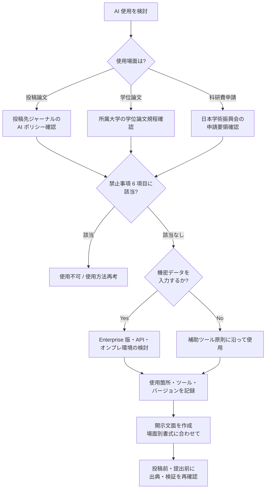

# research-integrity-ai-disclosure

投稿論文・学位論文・科研費申請における生成 AI 利用の開示判断と運用フレームワーク

---

## 1. Overview

研究活動における生成 AI の利用は、2023 年以降急速に普及した。文献検索の効率化、英語論文の推敲、データ可視化のコード補助など、適切に使えば研究生産性を上げる。一方で、図表の自動生成・本文の直接生成・研究設計の丸投げは研究誠実性を損なう。

本スキルは、投稿論文・学位論文・科研費申請の 3 場面で、何を開示すべきか、何が禁止されるかを判断するフレームワークを提供する。開示判断は国内外の研究倫理動向と出版社ポリシー、科研費等の公的資金の申請ルールが連動しており、研究支援職員が教員・学生からの相談を受けた際の標準対応が必要になる。

本スキルの特徴は、3 原則（補助ツール／二次的出典／独自視点再構築）を軸にすることで、新しい AI サービスが登場しても判断が揺らがない点にある。具体的には「AI は補助ツールであり創作者ではない」「AI 出力は二次的出典として扱い、一次文献で検証する」「最終的に独自視点で再構築する」を貫く。

日本の研究環境固有の事情として、科研費申請書式（日本学術振興会）への開示記載方法、学位論文規程との整合、大学の研究倫理審査委員会との連携、機密研究データの入力回避（特に未発表データ・学生個人情報）が挙げられる。本スキルはこれらを踏まえた日本大学向けの運用を提示する。

---

## 2. Prerequisites

- 所属大学の AI 利用ガイドライン・研究倫理規程の確認
- `skills/confidential-info-guidelines/` の 3 段分類の把握（未発表データは Level 3 機密情報）
- 投稿予定ジャーナル／出版社の AI 使用ポリシー確認（半期ごとに更新の可能性）
- 日本学術振興会の科研費申請様式・最新の記載要領の確認
- 所属大学の学位論文規程における AI 使用に関する記述の有無確認

---

## 3. 主な利用者

- **主な利用者**: 職員（研究推進課・学術情報課・URA）
- **副次的利用者**: 教員（研究倫理委員会委員、学位論文指導教員）
- **意思決定主体**: 研究者本人が執筆責任を負うが、大学の研究倫理規程・資金提供元のルールが優先される

---

## 4. 判断フレームワーク

### 3 原則

| 原則 | 内容 |
|---|---|
| 補助ツール原則 | AI は補助ツールであり、研究の主体・創作者ではない。最終成果の責任は研究者が負う |
| 二次的出典原則 | AI 出力は二次的な情報源として扱い、一次文献で検証する。AI 出力そのものを典拠にしない |
| 独自視点再構築原則 | AI 出力をそのまま使わず、自分の研究文脈で再構築・検証する |

### 3 場面別の開示判断フロー

**場面 I: 投稿論文**
- 出版社ポリシーに従う。Nature 系・Elsevier・IEEE 等は開示を求める
- 著者情報への AI 記載は不可（AI は著者になれない）
- 使用箇所・ツール名・バージョンを Methods または Acknowledgments に記載

**場面 II: 学位論文**
- 大学の学位論文規程に従う。規程に明記がなくても、指導教員と相談のうえ記載を推奨
- 「何を AI に、何を自分で」の区別を明示
- 未発表の研究データ・個人情報は AI に入力しない

**場面 III: 科研費申請**
- 日本学術振興会の最新申請要領に従う
- 補助的利用（文献整理・英文校正等）は許容、論旨生成は避ける
- 未発表の研究構想を AI に入力する際は機密性の扱いに注意

### 禁止事項 6 項目

1. 研究設計・仮説生成を AI に丸投げすること
2. データの改変・捏造・図表生成を AI に委ねること
3. 査読意見を AI に代筆させること
4. 論文本文の直接生成を AI に委ね、自分で検証しないこと
5. 機密性の高い研究内容（未発表データ、個人情報、産学連携の機密事項）を AI に入力すること
6. 学生の個人情報（成績、面談内容等）を学位論文執筆時に AI に入力すること

---

## 5. 判断フロー

---

## 6. 使用場面

### シーン A: 教員から論文投稿時の開示について相談を受ける

情報系の准教授から「Elsevier の雑誌に投稿予定だが、英文校正に ChatGPT を使った。開示する必要があるか」との相談。出版社ポリシーを確認すると開示が求められている。「英文推敲の補助として使用した」旨を Acknowledgments に記載する文面案を作成し、使用箇所とツール名・バージョンの記録方法を案内する。本文の主張部分には使用していないことを明示する書き方を提案する。

### シーン B: 大学院生から学位論文における AI 使用について質問される

文系大学院生から「先行研究の整理に ChatGPT を使いたいが、学位論文で問題になるか」との相談。3 原則を説明し、「AI で整理した結果は必ず一次文献にあたり、自分の研究文脈で再構築する」こと、「使用箇所は論文末尾の付記で明示する」ことを助言。指導教員とも事前に合意形成するよう促す。

### シーン C: 研究推進課で科研費申請書レビュー時に AI 使用が判明

教員の科研費申請書レビューで、申請概要の文章が申請者の過去の文体と異なると気づく。本人に確認すると「英語要約を ChatGPT で作った」とのこと。日本学術振興会の申請要領を再確認し、補助的利用は認められる範囲内であることを説明。ただし論旨の独自性は申請者自身で担保すべきであり、内容の検証を依頼。未発表の研究構想は機密扱いであることも伝える。

→ より詳細な事例は [`examples/example-01-kaken-shinsei-chatgpt.md`](examples/example-01-kaken-shinsei-chatgpt.md) を参照。
→ 主要出版社ポリシーは [`references/journal-policy-overview.md`](references/journal-policy-overview.md) を参照。

---

## 7. Limitations

- **所属大学の研究倫理規程が最優先**: 本スキルは汎用フレームワーク、各大学の規程が常に優先
- **出版社ポリシーは頻繁に更新**: Nature・Elsevier・IEEE 等のポリシーは半期ごとに変わる可能性。投稿時に最新情報を再確認
- **資金提供元ルールの違い**: 日本学術振興会・AMED・JST で扱いが異なる可能性。各資金の最新要領を参照
- **法的助言ではない**: 研究不正認定は重大判定であり、本スキルは業務判断の参考。法的問題は研究倫理委員会・法務部門と協議
- **AI サービスの仕様変更**: 学習設定・データ保存期間等は頻繁に変わる。利用時に最新情報を確認
- **未発表データの扱い**: 機密性の高い研究データは Enterprise 版・API 利用を検討。Web 版への入力は避ける

---

## References

- 【政府一次ソース】文部科学省「大学・高専における生成 AI の教学面の取扱いについて」（著作権留意点） https://www.mext.go.jp/b_menu/houdou/mext_01260.html
- 【資金提供元】日本学術振興会 科学研究費助成事業 最新申請要領 https://www.jsps.go.jp/j-grantsinaid/
- 【資金提供元】NIH NOT-OD-25-132 / NSF / UKRI / 国家自然科学基金委員会 2026 の AI 使用規定（各国公的研究資金）
- 【大学公式ガイドライン】（構造参照）筑波大学 教育における生成 AI 活用のガイドライン 2024 https://www.tsukuba.ac.jp/about/action-management/
- 【大学公式ガイドライン】（構造参照）中央大学大学院「学位論文等の執筆における『生成系 AI』利用上の留意事項」 https://www.chuo-u.ac.jp/aboutus/efforts/generative_ai/attention02/
- 【学術研究】MLA-CCCC Joint Task Force on Writing and AI (2023) https://hcommons.org/deposits/item/hc:59183/
