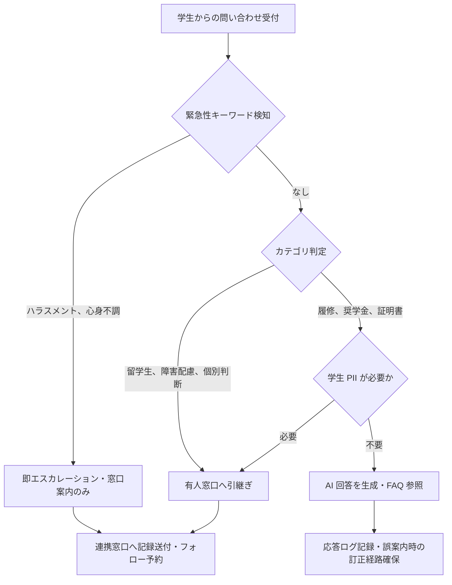

# student-inquiry-triage

学生問い合わせの AI 回答／有人対応への振り分けと、エスカレーション経路を整備するためのスキル

---

## 1. Overview

学生からの問い合わせは、履修登録・奨学金・証明書発行・留学生手続き・障害学生支援など多岐にわたり、時期によっては業務時間内では処理しきれない量となる。授業料納付や奨学金申請の締切前後、あるいは履修登録期間の夜間は特に問い合わせが集中する。一方、職員の時間外対応は働き方改革の観点から抑制されており、24 時間対応化と人員負担軽減を両立する仕組みとして生成 AI・チャットボットへの期待が高まっている。

しかし、学生は被教育者であり、大学との情報非対称性の中で不利な立場に置かれうる存在である。AI 回答の誤案内は成績・在籍・経済面で取り返しのつかない結果を招きうるため、問い合わせ内容に応じた AI 可 / 要人間対応の線引きが必須となる。特に、ハラスメント相談・心身不調・障害配慮・個別事情に起因する案件では、AI による一次応答ではなく即座に有人窓口へ引き渡す設計が求められる。

さらに、日本の大学特有の制約として、(a) 学生 PII は `confidential-info-guidelines` Level 3 に相当し原則 AI 非投入、(b) 単年度予算サイクルで Enterprise 契約を毎年継続できない小規模大学が多数、(c) 教職員権限分離のため回答内容によっては担当課をまたぐ調整が必要、という条件がある。本スキルは、これらを踏まえた振り分け判断フローと時間帯別応答設計を提供する。

---

## 2. Prerequisites

- 所属大学の AI 利用ガイドラインと学生個人情報取扱規程の確認
- `skills/confidential-info-guidelines/` の 3 段分類把握（**学生氏名・学籍番号・成績・相談ログは Level 3 で AI 非投入が原則**）
- 学生相談室・ハラスメント相談窓口・保健管理センター・障害学生支援室との連携体制と連絡経路の事前整理
- チャットボット導入を検討する場合は、利用予定サービスのデータ学習・保持ポリシーの確認

---

## 3. 主な利用者

職員（学生支援課・教務課・留学生センター・学生相談室事務局・奨学金窓口・証明書発行担当）

---

## 4. 判断フレームワーク

### 4-1. 問い合わせカテゴリ分類

| # | カテゴリ | 想定例 | 既定の振り分け |
|---|---|---|---|
| 1 | 履修 | 登録期間、GPA 計算、科目重複 | AI 可（事実ベース） |
| 2 | 奨学金 | 種類、申請書類、締切 | AI 可（事実ベース） |
| 3 | 証明書 | 発行手順、手数料、受取方法 | AI 可（事実ベース） |
| 4 | 留学生 | 在留資格・ビザ、アルバイト許可 | **要人間**（個別判断） |
| 5 | 障害学生 | 合理的配慮、支援申請 | **要人間**（個別判断） |
| 6 | ハラスメント | 相談、被害申告 | **即エスカレーション** |
| 7 | メンタル | 心身不調、希死念慮の兆候 | **即エスカレーション** |
| 8 | その他 | 上記に該当しない案件 | 内容により分岐 |

### 4-2. AI 回答可 vs 要人間対応の判断軸

- **事実ベースか判断ベースか** — 規程・締切・手順の引用で答えられるものは AI 可。個別事情評価が必要なら要人間
- **学生 PII の含有** — 氏名・学籍番号・成績・相談履歴が必要になる場面は AI に投入せず人間に引き継ぐ
- **緊急性** — ハラスメント・心身不調の示唆は一切の AI 判断を介さず即エスカレーション

### 4-3. 有人エスカレーション必須場面

次のキーワード・文脈を検知した場合、AI は回答を生成せず定型的な窓口案内のみ提示し、記録を連絡経路に送る。

- 「つらい」「死にたい」「消えたい」「誰にも言えない」等の心身不調表現
- 「ハラスメント」「セクハラ」「アカハラ」「パワハラ」等の相談申告
- 障害配慮・合理的配慮・試験時間延長等の申請相談
- 経済的困窮に起因する在籍継続の相談（単なる奨学金 FAQ と区別）

### 4-4. 時間帯別応答設計

- **平日昼間**: AI 一次応答 + 有人対応への円滑な接続を確保
- **平日夜間（18-23 時）**: 問い合わせ集中帯。AI による FAQ 応答中心、エスカレーション該当時は翌営業日の窓口予約を自動案内
- **深夜・休日**: AI 応答は最小限、緊急性の示唆があれば外部支援窓口（いのちの電話等）の連絡先を必ず併記

---

## 5. 判断フロー

---

## 6. 使用場面

### シーン A: 奨学金締切前日の履修相談（平日 22 時）

学生から「奨学金の申請書に履修予定科目を書くが、いま登録中の科目でよいか」と相談。履修科目は学生本人が画面で確認可能な情報であり、奨学金様式は公開されている。AI は規程・様式の記載ルールのみを提示し、具体的な科目名や学籍番号は入力させない。締切が翌日のため、万一の齟齬に備え翌朝一番の窓口予約枠を自動提示し、不安を抱えたまま夜を越えさせない設計にする。学生 PII は AI に投入せず、窓口に引き継ぐ際のみ本人が直接伝える前提を守る。

### シーン B: 留学生からの在留資格相談

留学生から「アルバイト時間の上限を超えた場合どうなるか」と問い合わせ。在留資格関連は出入国在留管理庁の判断事項であり、大学職員でさえ断定できない領域である。AI は一般的な資格外活動の枠組みを説明しつつ、個別状況は留学生センター担当者または行政書士へ案内する分岐を取る。在留カード番号・氏名・滞在歴等の個人情報は AI 履歴に残らないよう、案内文は「窓口で担当者に直接相談してください」で終える。誤案内が在留資格に影響する深刻さを踏まえ、AI が踏み込まない境界を明確にする。

### シーン C: メンタル不調が伺える学生問い合わせ

証明書発行の問い合わせに続けて「もう大学に来るのがつらい」「何のために続けているかわからない」という記述が含まれた場合、AI は証明書手続きの回答を試みず、その時点で一次応答を止める。学生相談室・保健管理センター・24 時間利用可能な外部支援窓口（いのちの電話等）の連絡先を提示し、同時に連携経路（学生支援課のエスカレーション当番、翌営業日の面談予約枠）へ自動で送る。**AI が「初期判定してから人間に繋ぐ」設計は取らない** — 心身不調の示唆があれば即時に人間へ引き渡すことで、AI の誤判定による対応遅延を回避する。

→ より詳細な事例は [`examples/example-01-shougaku-faq-bot.md`](examples/example-01-shougaku-faq-bot.md) を参照。

---

## 7. Limitations

- **所属大学の AI 利用ガイドラインが常に優先**。本スキルは汎用フレームワークであり、各大学の個別規程が上位。
- **学生 PII は AI 非投入が原則**（`confidential-info-guidelines` Level 3 参照）。氏名・学籍番号・成績・相談履歴を入力しない運用が前提。
- **サービス仕様・料金体系の変更**で運用設計が陳腐化しうる。年次レビューを推奨。
- **法令改正時の再確認**が必要（個人情報保護法、障害者差別解消法における合理的配慮義務化等）。
- **個別判断を要する案件は必ず有人対応**（障害配慮・ハラスメント・メンタル・留学生在留資格・経済的在籍相談）。AI の「初期判定してから人間」設計はこれらの案件では取らない。
- **AI ハルシネーションの残存リスク**。FAQ 回答の誤りは学生の成績・在籍・経済面に影響するため、回答ログの定期監査と学生からの誤案内報告経路を整備する。

---

## References

- 【政府一次ソース】文部科学省「大学・高等専門学校における生成 AI の教学面の取扱いについて」 https://www.mext.go.jp/b_menu/houdou/2023/mext_01260.html
- 【政府一次ソース】個人情報保護委員会「個人情報の保護に関する法律についてのガイドライン」 https://www.ppc.go.jp/personalinfo/legal/
- 【大学公式事例・構造のみ参照】芝浦工業大学 SIT-bot（Benefitter 掲載事例）/ 駒澤大学 LINE チャットボット（トランスコスモス発表）/ 広島大学チャットボット（GCDC）/ 京都大学 ILAS セミナー BOT（全学共通科目）
- 【実務家・構造のみ参照、文面非引用】EAB "What Are Students Asking University Chatbots?" / SNHU Penny（EdSights 連携）/ Georgia State Pounce / 清華大学 AI 心理輔導システム（プライバシー境界の参照）
