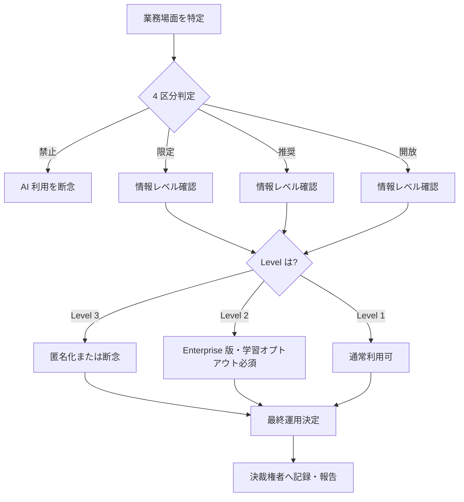

# ai-use-risk-classification

大学業務を「禁止・限定・推奨・開放」の 4 区分に判定し、機密情報 3 段分類と組み合わせて運用方針を導く横断スキル

---

## 1. Overview

`confidential-info-guidelines` は「情報の機密性」を Level 1-3 で分類するスキルだが、「この業務場面で AI を使ってよいか」という問いには直接答えない。機密性が低い公開情報でも、入試採点や成績評価の本体に AI を使うことは不適切で、逆に機密性が高い内部資料でも、下書き支援を Enterprise 版で安全に行える場面は存在する。

本スキルは、業務場面そのものの「AI 活用推奨度」を 4 区分（禁止・限定・推奨・開放）で判定し、3 段分類と直交する軸として運用に接続する。両者を組み合わせることで、「情報レベル × 業務場面」の 2 軸で最終運用を決定できる。部署ごとに異なる AI 利用方針を体系化する際にも、この 4 区分が共通言語として機能する。

---

## 2. Prerequisites

- 所属大学の AI 利用ガイドライン・成績評価規程・人事規程を確認済み
- `skills/confidential-info-guidelines/` の 3 段分類（Level 1-3）を把握
- 対象業務の決裁権者（学科長・部長・委員会等）を特定済み
- AI サービスの契約形態（Free／Enterprise／API）と学習オプトアウト設定を把握

---

## 3. 主な利用者

- **職員（主）**：企画課、情報基盤課、各部署の運用担当者
- **部署責任者・管理職**：部長、副学長、学科長、委員会主査
- **教員**：自身の業務範囲（研究・教育・会議運営）での利用判断

---

## 4. 判断フレームワーク

### 4-1. 4 区分と典型場面カタログ

| 区分 | 定義 | 典型場面 |
|---|---|---|
| **禁止** | いかなる環境でも AI 処理を禁ずる領域 | 入試採点、成績評価の最終判定、人事評価、学位論文の核心部執筆、懲戒判定 |
| **限定** | Enterprise 版等 学習オプトアウト確認済み環境のみ許容 | 学内機密の下書き支援、学外未公開の議事録要約、研究データの前処理、予算執行状況の整理 |
| **推奨** | 検証前提で日常利用を推奨 | 定型文の要約・翻訳・校正、情報整理、公開情報の再構成、研修教材の素案作成 |
| **開放** | 無料 Web 版も含め広く許容 | 自己学習、発散ブレスト、公開済み情報の読み解き支援、一般知識の確認 |

### 4-2. 情報レベル（3 段分類）との組み合わせ

- **禁止区分 × Level 3**：例外なく不可。匿名化しても区分自体が禁止
- **限定区分 × Level 2**：Enterprise 版かつ決裁権者の了承が前提
- **推奨区分 × Level 1-2**：Level 2 は契約条件確認、Level 1 は自由度高い
- **開放区分 × Level 1**：最も自由、カスタム指示にも機密を含めない原則のみ遵守

---

## 5. 判断フロー

`confidential-info-guidelines` の Level 判定と本スキルの 4 区分判定は直交し、両者を掛け合わせて最終運用を決定する。

---

## 6. 使用場面

### シーン A: 部局長会議での議事録自動化可否

学部長会議で「AI 議事録ツールを導入してよいか」と問われた際、議題ごとに 4 区分判定を行う。人事案件は禁止、カリキュラム改編は限定、広報確認は推奨、と議題により区分が異なるため、議事録全体を単一運用にせず議題単位で分割処理する設計に落とす。詳細は [`examples/example-01-bucho-kaigi.md`](examples/example-01-bucho-kaigi.md) を参照。

### シーン B: 広報原稿の AI 使用範囲設定

広報課が AI で報道発表の初稿を作成する際、「推奨区分 × Level 1（公開前提情報）」に該当するため日常利用を許容。ただし未公表の人事情報・予算情報が紛れ込む時点で「限定区分 × Level 2」に昇格するため、プロンプト投入前に機密情報の除去チェックを挟む運用にする。

### シーン C: 研究費申請の AI 支援範囲

研究者が科研費申請書執筆に AI を使う際、文献整理・動向要約は推奨、申請書本文の直接生成は禁止、という区分を事前に定める。未公開研究構想は Level 2-3 に該当するため、Enterprise 版の利用と開示記述が前提になる。

---

## 7. Limitations

- **所属大学のガイドラインが優先**：本スキルは汎用フレームであり、各大学の規程・内規・委員会決定が常に優先される
- **半期改訂を推奨**：AI サービスの契約形態・機能更新に伴い、区分境界は半期ごとに見直す
- **他スキルとの接続**：`confidential-info-guidelines`（情報軸）、`institutional-ai-adoption-checklist`（組織導入軸）と組み合わせて運用する前提
- **単年度予算制約**：Enterprise 契約の年度またぎ調整、権限分離（教員／職員）、学生データの特別扱い、各大学規程優先の 4 制約は本スキルの外側で検討が必要
- **区分境界の曖昧性**：禁止と限定、推奨と開放の境界は大学ごと・部署ごとに微調整が必要。本スキルは出発点のテンプレート

---

## References

- 【政府一次ソース】文部科学省「大学における生成 AI の教学面の取扱いについて（周知）」
- 【政府一次ソース】台湾行政院「及所属機関（構）使用生成式 AI 参考指引」（10 原則の構造参照）
- 【海外構造参考】上海交通大学「关于在教育教学中使用 AI 的规范（試行版）」4 分類（禁止・有限・鼓励・開放）を構造のみ参照、文面は日本の大学事務文脈で書き下ろし
- 関連スキル：`skills/confidential-info-guidelines/`（情報機密性 3 段分類）、`skills/institutional-ai-adoption-checklist/`（組織導入検討）
