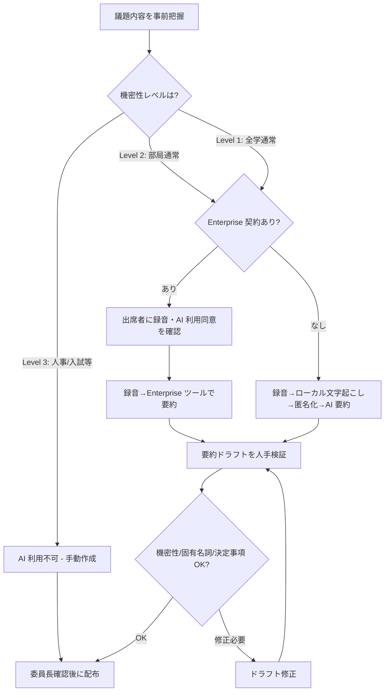

# committee-meeting-minutes-ai

委員会・教授会の議事録作成で生成 AI を安全・効率的に活用するための判断フレームとツール選定

---

## 1. Overview

学内委員会・教授会・部局運営会議などの議事録作成は、事務局担当職員にとって大きな負担であり、かつ正確性と機密性の両立が求められる業務である。録音→文字起こし→要約→配布の各段階で AI 活用の可能性があるが、会議の機密性（人事・入試・懲戒案件）や出席者の同意、各大学の議事録規程との整合が論点となる。

本スキルは、議題機密性 × 出席者同意 × 匿名化要否の 3 軸で判断フレームを提示し、Enterprise 契約の有無で分岐する 2 経路の運用フローを示す。`skills/confidential-info-guidelines/` の 3 段分類（Level 1-3）と接続し、議事録特有の「発言者特定」「決定事項の法的効力」「公開請求対応」といった論点にも触れる。

大学の単年度予算制約と、全学 Enterprise 契約がまだ普及しきっていない現状を踏まえ、有料ツール未導入の組織でも使える最小構成（手動録音＋事後確認型の要約）も併記している。教員・職員の権限分離の観点で、人事案件を扱う教授会では別基準が必要となるため、その境界線も明確にする。

---

## 2. Prerequisites

- 所属大学の議事録作成規程・情報セキュリティポリシー・会議体規則を事前確認
- `skills/confidential-info-guidelines/` の 3 段分類を把握
- 利用予定の AI 議事録ツールのデータ保管場所・学習ポリシー・削除手順を確認
- 出席者への録音・AI 利用の事前通知・同意取得プロセスが整っているか確認

---

## 3. 主な利用者

- **職員**（主）：委員会・教授会事務局担当、部局の庶務担当
- 意思決定主体は委員会議長・部局長。本スキルは事務局の判断・提案を支援する

---

## 4. 判断フレームワーク

### 4-1. 会議機密性の 3 レベル

| レベル | 例 | AI 利用方針 |
|---|---|---|
| Level 1（低） | 全学委員会の通常議事、広報会議、FD/SD 研修会 | 推奨（Enterprise またはオンプレ／閉域） |
| Level 2（中） | 部局教授会の通常議事、予算委員会 | 条件付き（Enterprise 限定＋議事録配布前の人手検証） |
| Level 3（高） | 人事案件を含む教授会、入試委員会、懲戒委員会 | 原則不可（手動作成、または匿名化後に限定利用） |

### 4-2. 出席者同意 × 匿名化の 2 軸

- **出席者同意**：録音実施と AI ツール使用の明示的同意を、開始冒頭で確認するのが原則
- **匿名化**：発言者特定が不要な要約（例：全学向け報告書）では匿名化済みテキストのみ AI に投入

### 4-3. ツール分類

- **オンプレ型**：学内サーバ上で動作（例：学内構築の Whisper 等）。データが外部に出ない
- **閉域型**：契約に基づき特定テナント内のみで処理（例：Azure OpenAI 経由の学内構築）
- **Enterprise 版 SaaS**：ChatGPT Enterprise、Microsoft Copilot for M365、Google Workspace など、学習オプトアウト契約済み
- **一般 SaaS**：ChatGPT 無料／Plus、各種 AI 議事録ツールの個人プラン

詳細な比較表は [`references/tool-overview-table.md`](references/tool-overview-table.md) を参照。

### 4-4. Enterprise 版あり／なしの 2 経路

- **あり**：Level 1-2 の会議で録音→ツールで文字起こし・要約→人手検証→配布
- **なし**：録音は手動、文字起こしはローカル Whisper 等、要約は匿名化後テキストのみ AI

---

## 5. 判断フロー

---

## 6. 使用場面

### シーン A: 全学 FD 研修会の議事要旨作成

Level 1 の全学研修会で、研修内容を後日全学メールで共有するケース。出席者同意は開始時に口頭確認済み、Enterprise 契約あり。録音→ツールで文字起こし→要点抽出→人手検証→配布の標準フローを使う。固有名詞（講師名・大学名）のみ確認すれば、所要時間は従来の 3 分の 1 程度に短縮できる。

### シーン B: 教授会（人事案件を含む）の議事録

Level 3。人事案件（昇格・任用）は発言者特定が不可欠な一方、AI ツールに発言内容を入力することは個人情報・機密情報保護の観点から不可。録音は議長の承認下で手動で行い、人事案件部分は手動で議事録作成。その他の Level 1-2 議題部分のみ、人事案件を除外した上で AI 要約を補助的に使う分割運用とする。

### シーン C: Enterprise 契約のない中小規模大学での運用

部局運営会議（Level 2 相当）で、Enterprise 契約が未導入の状況。スマホ録音→ローカル Whisper で文字起こし→発言者名・固有名詞を匿名化→匿名化済みテキストのみ ChatGPT 無料版で要約、というフローを構築する。匿名化が不完全だと効果が削がれるため、匿名化スクリプトを事前整備して担当者間で共有する。

→ より詳細な事例は [`examples/example-01-kyojukai-giji.md`](examples/example-01-kyojukai-giji.md) を参照。

---

## 7. Limitations

- 所属大学の議事録規程・会議体規則が常に優先
- AI 議事録ツールのデータ保管場所・学習ポリシーは頻繁に改定される。半期ごとに再確認
- 人事・懲戒・入試等の Level 3 議題については、本スキルは AI 不利用を推奨するのみで、代替効率化手段は提供しない
- 音声認識の誤認識（専門用語・固有名詞）は人手検証で必ず補正する必要がある
- 公開請求対応（情報公開法／各大学規程）が発生した際の AI 生成部分の扱いは、本スキルでは扱わない（各大学の法務と協議）

---

## References

- 【政府一次ソース】個人情報保護委員会「生成 AI サービスの利用に関する注意喚起等」
- 【大学公式ガイドライン】大阪大学「Knowledge Stack」構成解説（構造参照）
- 【大学公式ガイドライン】東北大学「法人 GAI」用途内訳（構造参照）
- 【実務家】森木「P4Us」議事録カテゴリ（MIT License）https://promptforus.com/
- 【ツール情報】notta, tl;dv, Rimo Voice 等各公式ページ（仕様参照のみ、内容引用なし）
