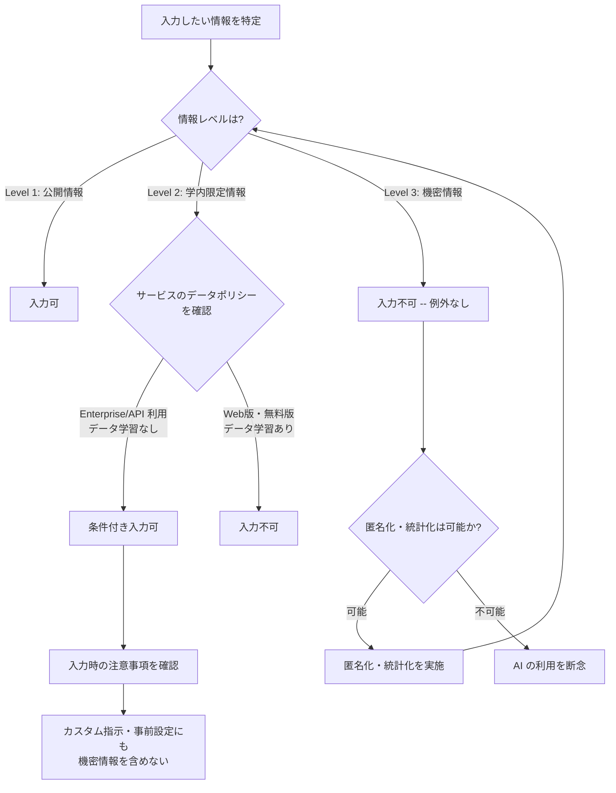

# confidential-info-guidelines

大学業務で扱う情報を 3 段分類し、生成 AI サービスへの入力可否を構造的に判断するフレームワーク。判定が個人感覚に依存しない共通の物差しを提供する。所属大学規程が優先される前提で、汎用的な判定軸を示す。

## いつ使うか

- 職員 / 研究者が AI 入力前に「これ、大丈夫か」と判断を迷った時
- 大学として AI 利用ガイドラインを策定 / 改定する時
- 情報漏洩インシデント後、判定基準を見直す時
- Custom GPT / Claude Projects / Microsoft Copilot エージェント等に登録するナレッジ・システムプロンプトの可否判断
- ファイル (PDF / Word / Excel / 画像) をそのままアップロードする際のリスク確認

使わない場面:
- 所属大学の独自判定フローが既に確立している場合 (大学規程優先)
- 個別サービスの最新契約条項確認 (`references/ai-service-comparison.md` 等で補完、サービス公式を一次ソースに)
- 法的判断 (本 skill は業務判断フレームワーク、法務部門 / 弁護士の助言ではない)

## 前提確認

本 skill を使う前に以下を確認する:

- **所属大学の AI 利用規程を確認する**: 多くの大学が独自ガイドラインを策定済み。本 skill は汎用フレームワーク、大学規程が優先
- **個人情報保護法の基本概念を把握する**: 個人情報の定義 / 要配慮個人情報 / 第三者提供制限。大学は個人情報取扱事業者として法的義務を負う
- **利用予定サービスの利用規約を確認する**: 入力データが学習に使用されるか、保存期間、データセンター所在地、Enterprise / Workspace 契約の有無

## 3 段分類

| レベル | 分類 | 例 | AI 入力 |
|---|---|---|---|
| Level 1 | 公開情報 | 大学 Web サイトの情報、公開された規程、シラバス、広報資料 | 可 |
| Level 2 | 学内限定情報 | 内部会議資料、未公開の検討案、業務マニュアル、学内通知 | 条件付き可 (Enterprise 版等) |
| Level 3 | 機密情報 | 学生の成績、個人情報、人事情報、研究データ (未発表)、入試問題 | 不可 |

### 各レベルの詳細

**Level 1 — 公開情報**
既に公開されている、または公開を前提とした情報。第三者に閲覧されても問題がない。

**Level 2 — 学内限定情報**
組織内部での共有を前提とした情報。外部に流出した場合に業務上の支障が生じうるが、法的リスクは限定的。データが学習に使用されない環境 (Enterprise 版 / API 利用等) であれば入力可。

**Level 3 — 機密情報**
法令 (個人情報保護法等) で保護される情報、または流出時に重大な損害が生じる情報。生成 AI サービスへの入力は不可。匿名化・統計化により Level 1-2 に変換できる場合がある。

## ファイル固有リスク

テキスト入力と異なり、ファイル / 画像をそのままアップロードする場合、本文以外の「見えない情報」が一緒に送信される。3 段分類に加え以下を確認する。

- **ファイルメタデータ**: Word / Excel / PDF には作成者名、最終更新者、更新履歴、コメント、トラックチェンジ、非表示シート、削除取消履歴が残る。本文上は Level 1-2 でもメタデータに Level 3 相当の個人名や内部議論が残るケースは珍しくない。アップロード前にメタデータを除去するか、必要部分のみをテキスト抽出して渡す
- **画像の EXIF / 位置情報**: スマートフォンで撮影した画像には撮影日時・GPS 座標・端末情報が付与される。学内施設や自宅の位置が推測可能な場合、Level 2-3 相当として扱う
- **OCR による「添付文書内の別情報」**: 会議資料 PDF を要約目的でアップロードしても、同じ PDF 内に別議題の個人情報や人事案件が含まれていれば AI はそれも読み取る。必要なページだけ切り出す、不要な箇所を黒塗りでなく削除する運用が望ましい。黒塗りは画像変換を経ないと PDF 上ではテキストとして残る
- **サービス側の添付保存期間**: チャット本文と添付ファイルで保存期間・削除ポリシーが異なるサービスがある。Enterprise 契約でも、添付ファイルの保存・ログ取得が別条項の場合があるため契約内容を確認する

## 判断フロー

### 判断の原則

- **迷ったら入力しない**: 判断に迷う場合は、より安全な選択肢を取る
- **匿名化で解決できないか検討する**: Level 3 の情報も適切な匿名化・統計化により安全に利用できる場合がある
- **カスタム指示 (System Prompt) にも注意**: 事前設定やカスタム指示に含める情報にも同じリスクがある

AI 使用シーン全体を「生成物の用途・責任範囲」で 4 区分に整理する判定は [`ai-use-risk-classification`](../ai-use-risk-classification/SKILL.md) を参照。本 skill の情報レベル判定と組み合わせて利用する。

## Custom GPT / Projects / Gem 等への登録

ChatGPT の Custom GPT、Claude の Projects、Gemini の Gem、Microsoft Copilot のエージェントなど、事前にナレッジ・指示を登録して再利用する機能が一般化している。これらに登録する情報は、チャット本文入力と同じリスクに加え以下の固有リスクがある。

- **閲覧範囲の誤認**: Custom GPT を「自分だけが使う」つもりで作成しても、共有・公開設定によっては組織外の全ユーザーが Knowledge ファイルを閲覧・抽出できる状態になる。学生個人情報や内部規程を Knowledge に入れる前に、必ず共有範囲を確認する (デフォルトが「公開」「リンクを知っていれば誰でも」になっているサービスもある)
- **システムプロンプト内の情報も送信される**: 「この GPT は◯◯大学学生課の△△さんのために動作する」のような自己紹介文でも、組織名・部署名・個人名は毎回 AI に送信される。サービス側の学習・ログ対象になるため、本文入力と同じ情報レベル判定を適用する
- **Knowledge と本文入力の組み合わせ**: Knowledge に Level 2 相当の資料を置き本文では Level 1 の質問しかしないつもりでも、AI の回答には Knowledge の内容が抽出されて混ざる。回答自体が Level 2 として扱われるべき状況が生まれる
- **判断軸の再掲**: 「本文入力に適さない情報は Knowledge にも適さない」「カスタム指示に適さない情報は GPT 説明文にも適さない」「Level 3 は一切含めない、Level 2 は Enterprise / Workspace 等の契約下でのみ」。迷う場合は匿名化・一般化してから登録する
- **配布・共有時の再確認**: 一度作った Custom GPT を他部署に共有する際、登録時点では問題なかった情報が時間経過で機密度が変わる (例: 未確定だった人事案件の確定後)。共有前に Knowledge とシステムプロンプトを再点検する運用を組み込む
- **削除・更新フローの明文化**: Knowledge に登録したファイルは、元ファイルを更新・削除してもサービス側に残り続ける。担当者の異動・制度改定・年度更新のタイミングで棚卸しを行う運用を設計段階で決めておく

## サービス別の注意点

主要な生成 AI サービスごとのデータ取り扱い概要。詳細な比較は [`references/ai-service-comparison.md`](references/ai-service-comparison.md) を参照。

- **ChatGPT**: Web 版 (Free / Plus) はデフォルトでデータが学習に使用される (オプトアウト可能、チャット履歴オフで回避可)。Team / Enterprise 版および API 利用では学習に使用されない
- **Claude**: Free / Pro 版は学習に使用しない (ユーザーが明示的に提供するフィードバックを除く)。API 版も学習に使用しない
- **Microsoft Copilot**: M365 テナント版は組織データ保護あり (コンプライアンス境界内で処理)。個人版は条件が異なる
- **Google Gemini**: Workspace 版は学習に使用しない。個人版は学習に使用される可能性あり

各サービスの利用規約・プライバシーポリシーは頻繁に更新される。利用開始時および定期的に最新情報を確認する。

## 使用場面

### ミニ判断例 A: 会議資料の PDF 丸ごとアップロード

「来週の会議で使う資料 30 ページを AI に要約させたい」という場面。本文は Level 2 相当 (内部検討資料) として判定できても、PDF をそのままアップロードするとファイル固有リスク節の論点が発生する。(1) PDF に未整理のトラックチェンジや作成者名が残っていないか、(2) 今回の議題と無関係な別議題のページが同梱されていないか、(3) 黒塗り個所が画像でなくテキストとして残っていないか の 3 点を確認する。Enterprise 契約下であっても、必要なページだけを切り出してテキスト抽出してから入力するのが望ましい。

### ミニ判断例 B: 留学生向け FAQ を Custom GPT 化する

「よくある質問を Custom GPT の Knowledge に入れて、留学生が 24 時間使える窓口を作りたい」という場面。FAQ 自体は Level 1 (広報情報) として登録可能だが、Custom GPT 節の観点で以下を追加確認する。(1) 共有範囲を「組織内のみ」に制限し学外からアクセスできない設定にする、(2) システムプロンプトに特定職員の個人名・内線番号を含めない (在職異動で陳腐化する上、外部公開時にリスク)、(3) Knowledge に「未公開の来年度制度変更」が混入していないか。担当者変更時の更新フローも同時に設計する。

詳細な事例は [`examples/`](examples/) ディレクトリを参照。

- [例 1: 学内委員会議事録の要約](examples/example-01-meeting-minutes.md) — Level 2 / 条件付き可
- [例 2: 学生の成績データ分析](examples/example-02-student-grades.md) — Level 3 / 不可 (匿名化で対応)
- [例 3: 大学公式 Web の英訳](examples/example-03-website-translation.md) — Level 1 / 可
- [例 4: 教員プロフィールページの英訳](examples/example-04-kyoin-profile.md) — Level 1 / 可 (条件確認あり)

## 限界

- **各大学の規程が優先**: 本 skill は一般的な判断フレームワーク。所属大学が独自 AI 利用ガイドラインを定めている場合、そちらが常に優先
- **データポリシーは変更される**: AI サービスのデータ取り扱いポリシーは頻繁に変更される。本 skill のサービス別情報は作成時点のもの、最新情報は各サービス公式ページで確認
- **法的助言ではない**: 本 skill は業務判断のためのフレームワーク、法的助言ではない。個人情報の取り扱いや契約上の問題など法的判断が必要な場合は専門家 (法務部門・弁護士等) に相談
- **研究データの特殊性**: 研究データの取り扱いは本 skill の情報分類に加え、研究倫理委員会の判断や研究資金提供元の規定も考慮する必要がある
- **画像・ファイル入力**: テキストだけでなく、画像やファイルをアップロードする場合も同じ判断フレームワークを適用する。ファイルに埋め込まれたメタデータ (作成者情報・位置情報等) にも注意

## 落とし穴

| 出てくる合理化 | 実態 |
|---|---|
| 「Enterprise 契約なら Level 3 でも入れて大丈夫」 | Enterprise 契約はデータ学習を止めるが、漏洩リスクやインシデント時の責任範囲、国内法令上の越境データ移転の論点はゼロにならない。Level 3 は Enterprise でも原則不可 |
| 「PDF を黒塗りしたから匿名化完了」 | PDF の黒塗りは多くの場合テキスト層に原文が残る。AI は透過して読む。黒塗りでなく該当ページ削除、またはテキスト抽出後に該当箇所削除する |
| 「学籍番号だけ消せば匿名化」 | 学籍番号・入試成績・専攻・発言特徴・研究テーマの組合せで個人が再特定されうる。k-匿名化や統計化の検討が必要 |
| 「Custom GPT は自分しか使わないから大丈夫」 | 共有設定のデフォルトが「リンクを知っていれば誰でも」のサービスがある。学外ユーザーが Knowledge ファイルを抽出できる設定のまま放置されるケース多数。必ず共有範囲を確認 |
| 「Knowledge に Level 2 を置き、本文は Level 1 で質問すれば安全」 | AI の回答は Knowledge の内容を抽出して混ぜる。回答自体が Level 2 として扱われるべき状況になる。Knowledge に置いた情報は出力される前提で分類する |
| 「議事録の前半だけ使いたいから全文アップして要約させれば OK」 | 後半に人事議題等の Level 3 が含まれていれば、AI は全文を読む。必要範囲のみテキストで切り出して渡す |
| 「サービス規約が学習しないと書いてあるから永久に安全」 | 規約は頻繁に改定される。過去に入力したデータの扱いが遡及的に変わる可能性を前提に、重要情報は常に最小限に留める |
| 「所属大学の規程が明文化されていないから自己判断で OK」 | 明文化がなくても情報セキュリティポリシーや個人情報保護規程が上位で効く場合が多い。情報セキュリティ担当部署に事前確認する経路を確保する |

## 関連

- [`skills/check-info-level/`](../check-info-level/SKILL.md) — 本 skill の Action 版、テキスト / ファイルを渡すと判定結果を返す Task skill
- [`skills/ai-use-risk-classification/`](../ai-use-risk-classification/SKILL.md) — 生成物の用途・責任範囲による 4 分類、大学 AI ポリシー起草時の上位フレーム
- [`skills/institutional-ai-adoption-checklist/`](../institutional-ai-adoption-checklist/SKILL.md) — 機関として AI 導入する際のガバナンス / 契約 / 人事 / 運用チェック
- [`references/ai-service-comparison.md`](references/ai-service-comparison.md) — 主要サービスのデータ取扱比較表
- [`references/skill-format-guide.md`](../../references/skill-format-guide.md) — v0.6 標準形式、本 skill の改修準拠先
