# confidential-info-guidelines

大学業務で生成AIサービスを利用する際の機密情報取り扱い判断フレームワーク

---

## 1. Overview

大学業務において生成AIの活用が広がる中、「この情報をAIに入力して問題ないか」という判断は日常的に発生する。しかし、その判断基準が個人の感覚に委ねられている現状では、情報漏洩リスクと業務効率化の間で一貫性のある意思決定ができない。

本スキルは、大学業務で扱う情報を3段階に分類し、生成AIサービスへの入力可否を構造的に判断するフレームワークを提供する。「入力していいか迷ったらこのフローに従う」という明確な基準を持つことで、安全かつ効率的なAI活用を実現する。

大学は学生の個人情報、研究データ、人事情報など、高い機密性を持つ情報を大量に扱う組織である。一般企業と異なり、学生という「顧客であり被教育者でもある」存在の情報を預かる特殊な立場にあるため、AIサービスへのデータ入力には一般的な企業以上の慎重さが求められる。

---

## 2. Prerequisites

本スキルを活用するにあたり、以下の事前確認を推奨する。

- **所属大学のAI利用規程（ガイドライン）の確認**: 多くの大学が独自のAI利用ガイドラインを策定している。本スキルは汎用的なフレームワークであり、所属大学の規程が常に優先される。
- **個人情報保護法の基本理解**: 個人情報の定義、要配慮個人情報、第三者提供の制限など、基本的な概念を把握しておくこと。大学は個人情報取扱事業者として法的義務を負う。
- **利用する生成AIサービスの利用規約確認**: サービスごとにデータの取り扱いポリシーが異なる。入力データが学習に使用されるか、データの保存期間、データセンターの所在地などを確認すること。

---

## 3. 情報分類の3段階

大学業務で扱う情報を以下の3段階に分類する。

| レベル | 分類 | 例 | AI入力 |
|---|---|---|---|
| Level 1 | 公開情報 | 大学Webサイトの情報、公開された規程、シラバス、広報資料 | 可 |
| Level 2 | 学内限定情報 | 内部会議資料、未公開の検討案、業務マニュアル、学内通知 | 条件付き可（Enterprise版等） |
| Level 3 | 機密情報 | 学生の成績、個人情報、人事情報、研究データ（未発表）、入試問題 | 不可 |

### 各レベルの詳細

**Level 1 -- 公開情報**
既に公開されている、または公開を前提とした情報。第三者に閲覧されても問題がない。

**Level 2 -- 学内限定情報**
組織内部での共有を前提とした情報。外部に流出した場合に業務上の支障が生じる可能性があるが、法的リスクは限定的。データが学習に使用されない環境（Enterprise版、API利用等）であれば入力可。

**Level 3 -- 機密情報**
法令（個人情報保護法等）で保護される情報、または流出した場合に重大な損害が生じる情報。生成AIサービスへの入力は不可。匿名化・統計化により Level 1-2 に変換できる場合がある。

---

## 4. 判断フロー

以下のフローチャートに従い、情報の入力可否を判断する。

```mermaid
flowchart TD
    A[入力したい情報を特定] --> B{情報レベルは?}
    B -->|Level 1: 公開情報| C[入力可]
    B -->|Level 2: 学内限定情報| D{サービスのデータポリシーを確認}
    B -->|Level 3: 機密情報| E[入力不可 -- 例外なし]

    D -->|Enterprise/API利用<br>データ学習なし| F[条件付き入力可]
    D -->|Web版・無料版<br>データ学習あり| G[入力不可]

    E --> H{匿名化・統計化は可能か?}
    H -->|可能| I[匿名化・統計化を実施] --> B
    H -->|不可能| J[AIの利用を断念]

    F --> K[入力時の注意事項を確認]
    K --> L[カスタム指示・事前設定にも<br>機密情報を含めない]
```

### 判断の原則

- **迷ったら入力しない**: 判断に迷う場合は、より安全な選択肢を取る。
- **匿名化で解決できないか検討する**: Level 3 の情報も、適切な匿名化・統計化により安全に利用できる場合がある。
- **カスタム指示（System Prompt）にも注意**: 事前設定やカスタム指示に含める情報にも同じリスクがある。

---

## 5. サービス別の注意点

主要な生成AIサービスごとに、データ取り扱いの概要を示す。詳細な比較は [`references/ai-service-comparison.md`](references/ai-service-comparison.md) を参照。

- **ChatGPT**: Web版（Free/Plus）はデフォルトでデータが学習に使用される（オプトアウト可能、チャット履歴オフで回避可）。Team/Enterprise版およびAPI利用では学習に使用されない。
- **Claude**: Free/Pro版は学習に使用しない（ユーザーが明示的に提供するフィードバックを除く）。API版も学習に使用しない。
- **Microsoft Copilot**: M365テナント版は組織データ保護あり（コンプライアンス境界内で処理）。個人版は条件が異なる。
- **Google Gemini**: Workspace版は学習に使用しない。個人版は学習に使用される可能性あり。

各サービスの利用規約やプライバシーポリシーは頻繁に更新される。利用開始時および定期的に最新情報を確認すること。

---

## 6. よくある判断例

### 例1: 学内の委員会議事録をAIで要約したい

- **情報レベル**: Level 2（学内限定情報）
- **判断**: Enterprise版やAPI利用であれば入力可。Web版（無料版）は不可。
- **理由**: 議事録には未公開の検討内容が含まれる。データが学習に使用されない環境であれば、外部流出リスクは限定的。
- **対応**: 大学が契約しているEnterprise版があればそちらを利用する。なければ、議事録から固有名詞や具体的な数値を除去してから入力を検討する。

### 例2: 学生の成績データをAIで分析したい

- **情報レベル**: Level 3（機密情報 -- 個人情報）
- **判断**: 不可。生の成績データはいかなるAIサービスにも入力してはならない。
- **理由**: 成績は個人情報保護法で保護される個人情報であり、学生との信頼関係の根幹に関わる。
- **対応**: 匿名化・統計化を実施する。「学科別の平均点と標準偏差」「成績分布のヒストグラムデータ」など、個人を特定できない形に加工すれば Level 1-2 として扱える。

### 例3: 大学の公式Webサイトの文章をAIで英訳したい

- **情報レベル**: Level 1（公開情報）
- **判断**: 可。どのサービスでも入力可能。
- **理由**: 既に公開されている情報であり、第三者に閲覧されても問題がない。
- **対応**: 任意のAIサービスで翻訳を実施し、出力結果を人が検証する。

---

## 7. Limitations

- **各大学の規程が優先**: 本スキルは一般的な判断フレームワークである。所属大学が独自のAI利用ガイドラインを定めている場合、そちらが常に優先される。
- **データポリシーは変更される**: AIサービスのデータ取り扱いポリシーは頻繁に変更される。本スキルに記載されたサービス別の情報は作成時点のものであり、最新情報は各サービスの公式ページで確認すること。
- **法的助言ではない**: 本スキルは業務判断のためのフレームワークであり、法的助言ではない。個人情報の取り扱いや契約上の問題など、法的判断が必要な場合は専門家（法務部門、弁護士等）に相談すること。
- **研究データの特殊性**: 研究データの取り扱いは、本スキルの情報分類に加えて、研究倫理委員会の判断や研究資金提供元の規定も考慮する必要がある。
- **画像・ファイル入力**: テキストだけでなく、画像やファイルをAIサービスにアップロードする場合にも同じ判断フレームワークが適用される。ファイルに埋め込まれたメタデータ（作成者情報、位置情報等）にも注意が必要。
