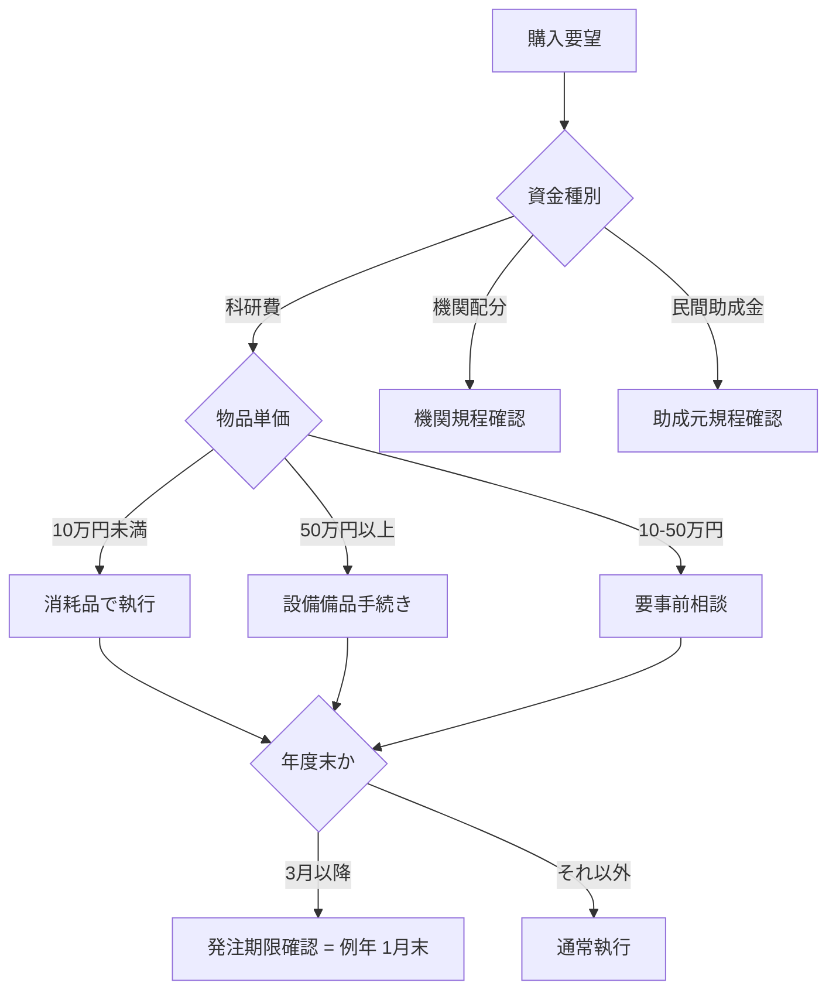

# 例 1: 「研究費執行管理」業務を Reference type の SKILL.md にする

## 入力

```
/create-action-skill
```

## skill 内対話の流れ

### Phase 1
**skill**: 「Reference type と Task type、どちらにしますか？」
**user**: 「Reference でいきたい。判断フレームワークを残しておきたい」

### Phase 2
**Q1**: 「業務 / ノウハウの概要は？」
**user**: 「科研費 / 機関配分研究費 / 民間助成金それぞれで、購入物の分類・年度末発注期限・出張費精算の判断基準が違う。これを担当者が迷わず判断できるように整理したい」

**Q2**: 「ユーザーがどんな発話で起動すべき？」
**user**: 「『この物品は備品？消耗品？』『年度末の発注期限は？』『この出張は科研費から出せる？』」

### Phase 3a (Reference 専用)
**Q3**: 「適用文脈は？」
**user**: 「研究支援課・経理課の担当者。研究者本人が確認するシーンも想定」

**Q4**: 「判断軸は？」
**user**: 「資金種別 × 物品種別の 2 軸マトリクス。年度末は別途タイムライン」

**Q5**: 「限界 / 例外は？」
**user**: 「機関ごとに会計規程が違う。本テンプレートは国立大学法人の標準的なケース」

### Phase 4
**Q8**: 「よくあるミスは？」
**user**: 「設備備品（50 万円以上）と消耗品の境界判定。直接経費と間接経費の混同」

**Q9**: 「参照する一次ソース」
**user**: 「文部科学省 科研費ハンドブック、JSPS 科研費ホームページ、所属大学経理規程」
**skill 補足**: 「いずれも政府一次ソース / 大学公式 → CC BY-SA 互換問題なし」

**Q10**: 「配置先は？」
**user**: 「research-support 領域に置きたい」
**skill**: 「`domain-skills/research-support/grant-fund-execution-rules/` で生成します」

## 生成されるファイル

- `domain-skills/research-support/grant-fund-execution-rules/SKILL.md`
- `domain-skills/research-support/grant-fund-execution-rules/examples/example-01-equipment-vs-supplies.md`

## 生成された SKILL.md frontmatter (抜粋)

```yaml
---
name: grant-fund-execution-rules
description: >
  「この物品は備品 / 消耗品どちらに分類？」「年度末の発注期限は？」
  「この出張は科研費から出せる？」と問われた時に使う、研究費執行
  判断フレームワーク。資金種別 × 物品種別の 2 軸マトリクスと
  年度末タイムラインで構造化。
version: 1.0.0
last_updated: "2026-04-19"
author: gmoriki
license: CC BY-SA 4.0
---
```

## 生成された SKILL.md 本体 (抜粋)

### `## 3. 判断マトリクス` セクション (Q4 の 2 軸マトリクスから)

| 資金種別 \ 物品種別 | 消耗品 (10 万円未満) | 設備備品 (50 万円以上) | 中間 (10-50 万円) |
|---|---|---|---|
| 科研費 (基盤 / 若手) | 直接経費から執行可 | 設備備品費区分、別申請 | 機関判断、要事前相談 |
| 機関配分研究費 | 機関規程に従う | 機関規程に従う | 機関規程に従う |
| 民間助成金 | 助成元規程優先 | 助成元規程優先 | 助成元規程優先 |

### `## 4. 判断フロー` セクション (Q4 + 年度末タイムラインから Mermaid 化)



このように、ヒアリング回答 (Q4) の「資金種別 × 物品種別 2 軸マトリクス + 年度末タイムライン」が `## 3` (表) と `## 4` (Mermaid) の 2 セクションに展開されている。

## なぜこの skill 生成プロセスが適切か

- type 選択を最初に問うことで、ユーザーの意図（人が読む規程 vs AI 実行手順）を明確化
- 一次ソース確認時にライセンス互換性を skill 側が補足（CC BY-SA 違反を未然防止）
- 配置先を ヒアリングで対話決定（domain-skills/ 6 領域から選択）
- 生成後にユーザーレビューを必ず促す（AI が勝手に書いた内容を「完成」と扱わない）
