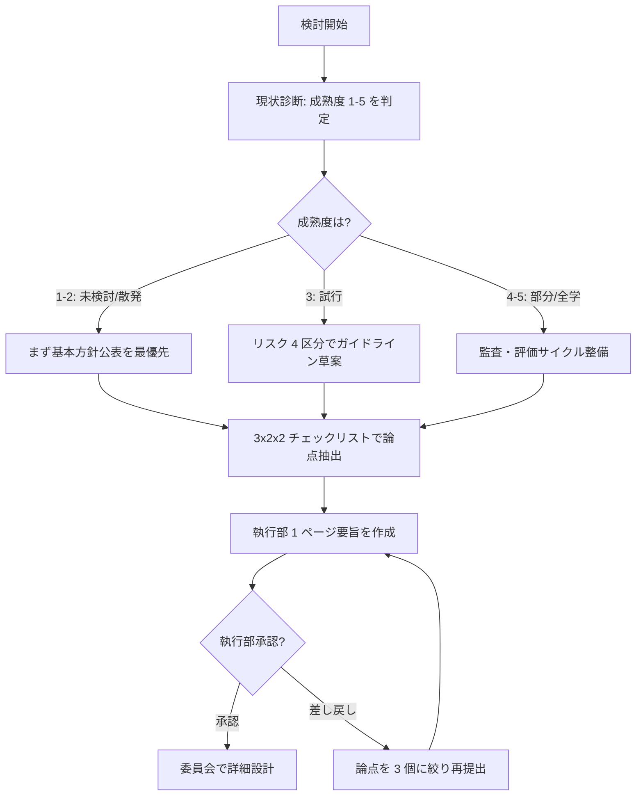

# institutional-ai-adoption-checklist

組織として生成 AI 導入を検討する大学のための、チェックリスト・成熟度モデル・執行部上程資料テンプレ

---

## 1. Overview

多くの日本の大学は、学長メッセージや情報セキュリティポリシーは公表しているものの、「組織として導入するかどうか」「全学展開時に何を揃えるか」のレベルで合意形成が止まっている。委員会で毎回「何を議論すればよいか」を作るところから始まるため、検討が前進しない。

本スキルは、企画・情報部門および管理職層が、組織導入検討の委員会初回資料から執行部上程資料までを一気通貫で設計するための、チェックリスト・分類・成熟度モデル・1 ページ要旨テンプレを提供する。他大学事例を下敷きに、日本の大学固有の制約（単年度予算、教員／職員の権限分離、学生データの扱い、規程優先）を織り込んで書き下ろした。

本スキルは単独でも機能するが、`skills/confidential-info-guidelines/` および `skills/staff-ai-literacy-primer/` と併用すると、導入後の運用整備まで見通せる。導入是非の判断は各大学の執行部の専権事項であり、本スキルは判断材料の整理を支援する位置付けである。

---

## 2. Prerequisites

- 所属大学の AI 利用ガイドライン・情報セキュリティポリシー・研究倫理規程を事前確認
- `skills/confidential-info-guidelines/` の 3 段分類を把握
- 現状の AI 利用実態（アンケート等）の把握が望ましい（なくても初回資料は作成可）
- 執行部・委員会の意思決定サイクル（年度／半期）を把握

---

## 3. 主な利用者

- **職員**（主）：企画課、情報基盤課、学長室、総合企画室
- **管理職**：副学長、情報担当理事、部長級
- 意思決定主体は執行部・評議会・委員会。本スキルは議論の土台整備を支援する

---

## 4. 判断フレームワーク

### 4-1. 3 カテゴリ × 2 ステップ × 2 主体のチェックリスト

| カテゴリ | 最優先（ステップ1） | 優先（ステップ2） |
|---|---|---|
| 全般 | 大学: 基本方針公表／個: 情報分類理解 | 大学: ガイドライン改定サイクル／個: リテラシー研修受講 |
| 教育 | 大学: シラバス方針テンプレ／個: 授業内 AI 方針明示 | 大学: 評価方法再設計／個: 課題形式の見直し |
| 環境 | 大学: 契約・認証基盤／個: サービス選定研修 | 大学: 学内運用ログ・監査／個: インシデント報告経路 |

各セルで「どこまで実装済みか」を自己採点（未着手／検討中／整備中／運用中）する。

### 4-2. リスク分類 4 区分

- **禁止**：学生の個人情報・入試問題等、いかなる環境でも AI に入力しない領域
- **限定**：Enterprise 契約等 学習オプトアウト確認済みに限り可
- **推奨**：文書ドラフト・翻訳・要約など、検証前提で日常利用を推奨
- **開放**：公開情報の整理・広報素材生成など、無料 Web 版も含め許容

### 4-3. 5 段階成熟度モデル

1. **未検討**：公式見解なし
2. **散発利用**：個々の職員・教員が私的に試行
3. **試行**：特定部署で限定契約・パイロット運用
4. **部分展開**：全学契約だが対象限定／ガイドライン公表済み
5. **全学展開**：全職員・教員・学生が一定の条件下で利用、監査・評価サイクルあり

### 4-4. 執行部用 1 ページ Executive Summary テンプレ

A4 一枚で、①背景、②他大学動向、③自学の現状（成熟度）、④検討論点 3 つ、⑤想定コスト、⑥判断期日、を記述する構成。本文は `examples/example-01-committee-kickoff.md` に収録。

---

## 5. 判断フロー

---

## 6. 使用場面

### シーン A: AI 検討委員会の初回資料作成

企画課が、情報担当理事から「来月の AI 検討委員会を立ち上げるので初回資料を作って」と指示された際、3 カテゴリ × 2 ステップ × 2 主体のチェックリストに沿って、他大学公表ガイドラインを横並びで比較するページと、自学の成熟度自己診断ページ、論点 3 選（ガイドライン／契約／研修）の叩き台を作成する。論点は 3 個に絞ることで、初回で方向性の合意を得やすくする。

### シーン B: 執行部上程用 1 ページ Executive Summary

副学長から「次の役員会議で 10 分で説明できる 1 枚資料を」と依頼された際、テンプレに沿って背景・他大学動向・現状成熟度・論点・コスト・期日の 6 要素を A4 一枚に収める。数値は概算で構わないが、判断期日だけは必ず明記することで、決断を先送りさせない構造にする。

### シーン C: 自学の現状成熟度診断

年度始めに、情報基盤課が単独で自学の成熟度を 1-5 で判定する。個々の職員が私的に ChatGPT を試している段階（成熟度 2）なのに全学展開計画（成熟度 4-5 レベル）を立てようとしていないか、自己診断で過熱を抑える。診断結果を 3 カテゴリ × 2 ステップ × 2 主体のチェックリストに落とし、次年度予算要求に反映する。

→ より詳細な事例は [`examples/example-01-committee-kickoff.md`](examples/example-01-committee-kickoff.md) を参照。

---

## 7. Limitations

- 所属大学の AI 利用ガイドラインが常に優先。本スキルは汎用的な検討支援である
- 成熟度モデルは自己申告に依存するため、外部監査との整合は別途必要
- チェックリストは網羅的ではなく、各大学固有の論点（医学部附属病院・地方自治体連携等）は追加記述が必要
- 単年度予算制約下では、Enterprise 契約の年度またぎ調整が別論点として発生する
- 法人格（国公立／私立／公立大学法人）による意思決定構造の差は本スキルでは捨象している

---

## References

- 【政府一次ソース】文部科学省「大学における生成 AI の教学面の取扱いについて（周知）」
- 【大学団体】日本私立大学連盟「大学における生成 AI の利用に関するチェックリスト」（構造参照、文面独自）
- 【実務家】森木「大学事務組織における生成 AI 導入のリスクとリターン」note（MIT 準拠の本人記事）
- 【海外構造参考】JISC AI Maturity Toolkit（構造のみ参照、文面引用なし）
- 【海外構造参考】上海交通大学「4 分類型 AI 利用方針」（構造のみ参照、日本語で独自表現）
