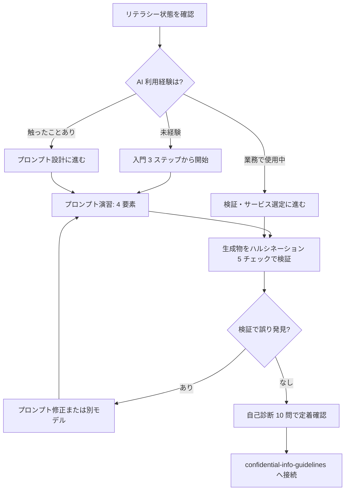

# staff-ai-literacy-primer

新任〜中堅の大学職員が生成 AI を安全に業務利用できるようになるための、30〜60 分で使えるリテラシー入門と研修骨子

---

## 1. Overview

大学事務の現場では、文部科学省・各大学ガイドラインの公表以降、生成 AI を「触ったことはあるが、業務に組み込む自信はない」という職員層が厚い。新任職員研修・SD 研修の担当者は、毎年の人事異動サイクルの中で、短時間でリテラシー底上げを図る必要に迫られている。

本スキルは、担当者が単独で 30 分〜1 時間の研修コアを組み立てられるよう、①入門 3 ステップ、②ハルシネーション検出 5 チェック、③自己診断 10 問の 3 点セットを提供する。講師経験が浅くても、配布資料 1 枚と演習 1 本で研修として成立する最小構成を目指した。

大学には単年度予算制約と人事異動による知見喪失、教員と職員の権限分離、学生データの取り扱い制限など、一般企業とは異なる環境がある。本スキルは「異動で担当が変わっても引き継げるリテラシー」を前提に設計している。研修後は `skills/confidential-info-guidelines/` を組み合わせ、情報分類判断まで到達することを想定する。

---

## 2. Prerequisites

- 所属大学の AI 利用ガイドライン・情報セキュリティポリシーを事前確認
- `skills/confidential-info-guidelines/` の 3 段分類（Level 1〜3）を把握
- 受講者のデジタル習熟度（PC 操作・検索エンジン利用の基礎）を想定
- 研修で使う AI サービス（無料 Web 版か学内契約済みか）を事前に整理

---

## 3. 主な利用者

- **職員**（主）：新任〜中堅、情報系・人事系・研修企画担当
- **SD 研修担当**：1 回 60 分以内でリテラシー導入を終わらせたい層
- 意思決定主体は研修設計者。本スキルは研修教材のコアを提供する

---

## 4. 判断フレームワーク

### 4-1. 入門 3 ステップ

1. **使い分け**：「調べる」は検索エンジン、「考える・まとめる」は AI、「判断する」は人間、という役割分担を受講者に刷り込む
2. **プロンプト**：役割指定・目的・制約・出力形式の 4 要素を 1 文で書く練習（例：「広報担当として、学生向けに、150 字以内で、箇条書きで」）
3. **検証**：生成結果を必ず自分の知識・一次資料と照合、根拠不明な数値・固有名詞・法令名は鵜呑みにしない

### 4-2. ハルシネーション検出 5 チェック

1. 固有名詞（人名・大学名・法令名）が実在するか
2. 数値・年号・条項が一次資料と一致するか
3. 論理に飛躍・矛盾がないか
4. 「出典を示して」と追い返したとき、実在する URL が返るか
5. 別モデルや別セッションで同じ質問をしたとき、同じ答えになるか

### 4-3. 自己診断 10 問（例）

- 学生の成績データを要約してもらいたい。どのサービスに入力可？
- 新任職員に教えるとき、プロンプトの最低要素は？
- AI が出した法令の条文を信じていい条件は？
- 会議録音を文字起こしする前に確認すべきことは？

（全 10 問を `examples/example-01-sd-kenshu-design.md` に収録）

---

## 5. 判断フロー

---

## 6. 使用場面

### シーン A: 新任職員研修 60 分スロットの設計

人事課から「今年度の新任職員 SD 研修に AI 基礎を 60 分入れたい」と依頼された際、入門 3 ステップ（15 分）、プロンプト演習（20 分）、ハルシネーション検出（15 分）、自己診断（10 分）の時間配分で骨子を作る。配布資料は A4 両面 1 枚で済む構成にし、講師自身が別部署に異動しても翌年度に引き継げるよう、スライド原稿と進行台本を同時に作る。

### シーン B: 自分自身のリテラシー棚卸し

中堅職員が、生成 AI を業務でなんとなく使っているが体系的に学んだことがない、という状態から脱するために自己診断 10 問を順に解く。正答率 7 割未満の領域（例：検証手法が甘い）を特定し、本スキル該当節を重点的に読み直す。所属大学のガイドライン該当箇所への相互参照を付箋化しておくと、他の職員から相談を受けた際の受け答えが安定する。

### シーン C: 若手職員同士のピア学習会

部署内の若手 3〜5 名で週 1 回 30 分の勉強会を回す場合、入門 3 ステップを 1 週目に割り当て、2 週目以降は各週 1 つのハルシネーション検出チェックを順に深堀りする。各回 1 人がファシリテータを持ち回り、実業務のプロンプト失敗例を持ち寄る形式にすると、異動引き継ぎとしても機能する。

→ より詳細な事例は [`examples/example-01-sd-kenshu-design.md`](examples/example-01-sd-kenshu-design.md) を参照。

---

## 7. Limitations

- 所属大学の AI 利用ガイドラインが常に優先。本スキルは汎用骨子である
- 生成 AI サービスの仕様・料金・ポリシーは 3〜6 か月で大きく変わる。研修資料は半期ごとに要点を見直す
- 本スキルは「基礎リテラシー」のみ対象。業務別の応用は `domain-skills/` を参照
- 法令（個人情報保護法、著作権法）の詳細解釈は法務部門に委ねる
- 受講者間のデジタル習熟度差が大きい場合、入門 3 ステップの前に PC 基本操作の補習が必要

---

## References

- 【政府一次ソース】文部科学省「大学における生成 AI の教学面の取扱いについて」https://www.mext.go.jp/
- 【大学公式ガイドライン】筑波大学「生成 AI の利用に関する基本ガイドライン」（構造参照）
- 【実務家】森木（gmoriki）「P4Us — 大学職員のためのプロンプトガイド」（MIT License）https://promptforus.com/
- 【実務家】codemp「大学職員が参考にできるかもしれない ChatGPT 使用事例／プロンプト集」https://note.com/codemp/
- 【研究】EDUCAUSE Horizon Action Plan（構造参照のみ、文面引用なし）
